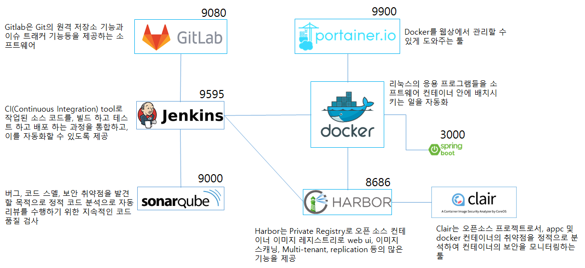

# Study 구성

Study 글은 Markdown(MD)로 작성되었습니다.

## Markdown

### **마크업(MarkUp)언어란?**

> **마크업 언어**는 **"마크(Mark)"로 둘러싸인 언어**입니다. **"태크(Tag)"**로 둘러싸였다고도 표현합니다. HTML, XML 등의 마크업 언어들은 문서의 구조를 정의합니다.

### 마크다운(MarkDown)언어란?

> [**Markdown**](http://whatismarkdown.com/)은 텍스트 기반의 마크업언어로 특수기호와 문자를 이용한 매우 간단한 구조의 문법을 사용하여 웹에서도 보다 빠르게 컨텐츠를 작성하고 보다 직관적으로 인식할 수 있다.

### .md 파일 문법

- \# : 페이지 헤딩입니다. html의 <h1> ~ <h6> 태그에 해당합니다. 쓰고 싶은 만큼 붙여서 쓰면 됩니다. (최대 6개)
- \* 순서가 없는 리스트를 만들 수 있습니다. 탭으로 안쪽으로 들여쓴 목록을 만들 수 있습니다.
- \1. 2. 3. ... : 순서가 있는 리스트를 만들 수 있습니다. 탭으로 안쪽으로 들여쓴 목록을 만들 수 있습니다.
- *[글씨]* : 기울인 글씨를 쓸 수 있습니다.
- **[글씨]** : 굵은 글씨를 쓸 수 있습니다.
- [링크 내용](링크 주소) : 링크를 만들 수 있습니다. 주소 url을 그대로 적으면 자동으로 링크가 만들어 집니다.
- \> : 인용구를 작성합니다.

## GIT

>  깃은 컴퓨터 파일의 변경사항을 추적하고 여러 명의 사용자들 간에 해당 파일들의 작업을 조율하기 위한 분산 버전 관리 시스템