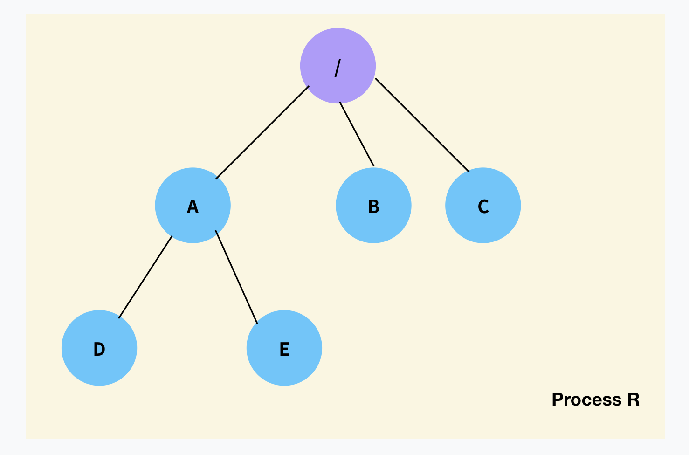
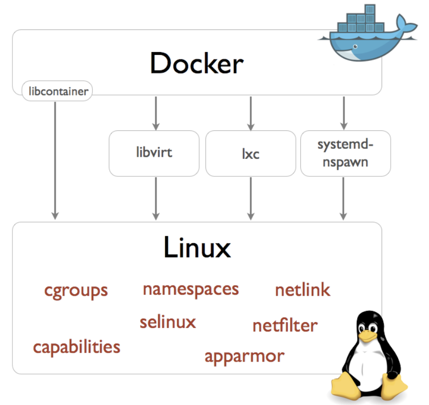

# 컨테이너 기반 가상화 플랫폼 ‘도커(Doker)’의 이해

>들어가며: 컨테이너 가상화, 그리고 chroot

“혁신은 없었다” 애플의 신제품이 나올 때마다 들리는 이야기입니다만, 컨테이너야 말로 “혁신은 없었던 신기술” 중에 하나입니다. 2013년에 등장한 도커Docker를 중심으로 컨테이너는 이제 애플리케이션을 사용자의 요구에 맞제 시스템 자원을 할당, 배치하고 배포하는 기술의 표준이 되었습니다.

도커가 등장한 이후로 컨테이너는 많은 발전이 있었습니다만, 처음 도커가 등장했을 때 컨테이너는 리눅스 커널의 프로세스를 조작하기 위한 기능들을 조합해서 만들어진 결과물이었습니다. 도커의 성공은 기술적 혁신에 기반했다기보다는 컨테이너의 약점을 잘 보완하고 그 빛나는 가치를 먼저 파악하고 편리한 인터페이스를 제공했다는 데 있다고 보는 것이 정확할지도 모릅니다.

네임스페이스, cproup, 유니온 마운트를 비롯한 컨테이너를 구현하기 위한(격리된 프로세스를 생성하기 위한) 여러가지 기능이 있습니다만, 그 중에서도 가장 오래되고 기본이 되는 것은 프로세스가 실행되는 루트를 변경하는 일입니다. chroot는 1979년 Version 7 Unix에서 시스템콜로 처음 구현된 기능으로 벌써 40년이나 된 기능입니다. 2005년에 선Sun에서 솔라리스 컨테이너라는 기능을 공개하면서 컨테이너라는 용어를 처음 사용합니다. 솔라리스 컨테이너는 스테로이드 맞은 chroot라고 묘사되었는데, 이를 통해서 chroot가 컨테이너에 있어서 상당히 중요한 역할을 하고 있다는 것을 유추해볼 수 있습니다. 현재는 리눅스에도 같은 이름으로 구현되어있으며 대부분의 배포판에서 별다른 설치 없이 바로 사용해볼 수 있습니다.

chroot는 굉장히 단순한 프로그램입니다만 막상 사용하기가 쉽지는 않습니다. 이 글에서는 chroot가 어떻게 동작하고, 실제로 사용하기 위한 방법들에 대해서 소개합니다.

### chroot 설치 및 명령어  

chroot 프로그램은 대부분의 리눅스 배포판에 기본적으로 설치가 되어있습니다. 따라서 별도의 설치 없이 사용할 수 있습니다.

```Shell Script
$ chroot --version
chroot (GNU coreutils) 8.28
Copyright (C) 2017 Free Software Foundation, Inc.
License GPLv3+: GNU GPL version 3 or later <http://gnu.org/licenses/gpl.html>.
This is free software: you are free to change and redistribute it.
There is NO WARRANTY, to the extent permitted by law.

Written by Roland McGrath.
```

만약 설치가 되어있지 않다면 우분투<sup>Ubuntu</sup>의 경우 coreutils 패키지로 설치할 수 있습니다.

```Shell Script
$ apt-get install coreutils
```

chroot 명령어는 단순합니다. 기본적으로 다음과 같은 형식으로 사용합니다.

```Shell Script
Usage: chroot [OPTION] NEWROOT [COMMAND [ARG]...]
```
기본적으로는 chroot 명령어 뒤에 루트로 사용할 디렉터리를 지정하고, 그 뒤에 이 루트를 기반으로 실행할 애플리케이션의 경로를 지정하는 방식입니다. 참고로 chroot는 **root 권한**을 필요로 합니다.

```Shell Script
$ chroot /tmp/new_root /bin/bash
chroot: failed to run command ‘/bin/bash’: No such file or directory
```

### chroot의 동작 원리

chroot를 사용하기에 앞서 chroot라 루트를 변경한다는 게 어떤 의미인지 알아보겠습니다. chroot는  Change Root Directory의 줄임말로 명령어 자체가 루트 디렉터리를 바꾼다는 뜻을 가지고 있습니다. 시스템의 일반적인 파일 구조를 생각해보겠습니다.




루트 디렉터리 아래에 A, B, C 그리고 다시 A 아래에 D, E 요소가 있는 구조를 생각해보겠습니다. 위 그림에서 확인할 수 있듯이 모든 요소는 루트 아래에 존재하게 됩니다. 이 시스템 위에서 어떤 프로세스 R을 실행했다고 해보겠습니다.

이 프로세스 R은 기본적으로 루트 디렉터리를 기준으로 다른 파일들을 탐색할 수 있습니다. 예를 들어 프로세스 아래에서 A 아래의 E 파일에 접근하고자 한다면 /A/E와 같이 접근할 수 있습니다. 우리가 실행하는 프로세스들은 기본적으로 이러한 방식으로 파일 시스템에 접근합니다. 즉, 일반적인 프로세스는 파일 시스템의 /를 루트 디렉터리로 하는 프로세스라고 말할 수 있습니다.

chroot는 바로 이 루트 디렉터리 /를 다른 위치로 지정해서 프로세스를 실행해주는 프로그램입니다. 여기서 아주 중요한 사실이 있습니다. 루트 디렉터리를 파일 시스템의 최상위 요소인 /으로 지정하지 않는다면, 결국 / 아래의 어떤 디렉터리만이 새로운 루트가 될 수 있다는 점입니다. 예를 들어 A를 루트 디렉터리로 하는 프로세스 K를 생각해보겠습니다.


chroot를 사용해 실행된 프로세스 K의 루트 디렉터리는 더 이상 /이 아닙니다. /A가 루트 디렉터리가 됩니다. 여기서 프로세스 R과 아주 중요한 차이가 발생합니다. 프로세스 R은 /를 기준으로 그 아래의 모든 파일을 탐색할 수 있었습니다. 하지만 프로세스 K의 루트 디렉터리는  /A이기 때문에 /에 접근하는 것이 불가능합니다. 그리고 / 아래에 있는 B와 C에도 접근할 수 없습니다. 왜냐면 프로세스 K에게는 /A가 최상위 디렉터리, 즉 /이기 때문에 그 위에 있는 경로를 표현할 방법 자체가 없습니다.

이처럼 루트 디렉터리를 변경하면 특정 프로세스(K)가 상위 디렉터리에 접근할 수 없도록 격리 시킬 수 있습니다. 정확히 이 역할을 하는 것이 chroot 명령어입니다.

### chroot 입문: 새로운 루트에서 프로그램 실행하기

그리고 바로 이 이유 때문에 chroot는 사용하기가 어렵습니다. 앞서 살펴본 예제 명령어로 되돌아가 보겠습니다.

```Shell Script
$ chroot /tmp/new_root /bin/bash
chroot: failed to run command ‘/bin/bash’: No such file or directory
```

이 명령어는 /tmp/new_root를 루트 디렉터리로 /bin/bash 명령어를 실행하라는 의미입니다.  /tmp/new_root가 새로운 루트 디렉터리가 된다는 것은 이제 이해가 되었습니다. 그런데  /bin/bash는 실행되지 않습니다. 시스템의 루트에 /bin/bash가 존재하더라도 이 명령은 실패합니다. 왜냐하면 chroot의 두번째 인자가 되는 프로그램은 기존 루트를 기반으로한 프로그램 경로가 아니기 때문입니다. /bin/bash는 새로운 루트 디렉터리 아래의 경로입니다. 따라서 이 프로그램은 이 명령어를 시스템의 /bin/bash가 아니라 /tmp/new_root/bin/bash에서 찾습니다. 심지어 /bin/bash는 보이지조차 않습니다. 아!

그렇다면 /bin/bash를 /tmp/new_root/bin/bash로 복사해보겠습니다.

```Shell Script
$ mkdir -p /tmp/new_root/bin/
$ cp /bin/bash /tmp/new_root/bin/
```

새로운 루트가 될 디렉터리 아래에서 tree를 사용해 새로운 루트 아래의 파일을 확인해보겠습니다.

```Shell Script
$ cd /tmp/new_root
$ tree
.
└── bin
    └── bash

1 directory, 1 file
```

/tmp/new_root 디렉터리를 새로운 루트라고 생각한다면, /bin/bash 경로에 bash 명령어가 준비되었습니다. 같은 chroot 명령어를 사용해 다시 실행해보겠습니다. bash가 실행될지는 모르겠지만 적어도 No such file or directory 에러는 출력되지 않을 것입니다.

```Shell Script
$ chroot /tmp/new_root /bin/bash
chroot: failed to run command ‘/bin/bash’: No such file or directory
```

놀랍게도 예상과 달리 같은 이유로 명령어 실행에 실패합니다. 이 오류는 잘못된 정보라는 점에서 조금 미묘합니다만 bash를 실행하기 위해서는 추가적인 준비작업이 필요합니다.

#### **bash: ldd로 의존성 탐색**

어떤 프로그램은 프로그램 파일만으로 실행이 되기도 하지만, 많은 프로그램들은 시스템 상에 다른 파일에 의존하고 있습니다. 이를 동적 라이브러리라고 합니다. bash 또한 이러한 파일들에 대한 의존성을 가지고 있고, 파일 시스템 아래에 이 파일들이 존재하지 않으면 실행이 되지 않습니다. 어떤 프로그램이 의존하고 있는 라이브러리 파일을 추적할 수 있는 프로그램이 바로 ldd입니다.  ldd는 다음과 같이 사용합니다.

```Shell Script
$ ldd <PATH>
```

<PATH>에는 의존성을 확인하고자 하는 프로그램의 경로를 넣어줍니다. 여기서는 /bin/bash를 지정하겠습니다.

```Shell Script
$ ldd /bin/bash
        linux-vdso.so.1 (0x00007ffc3b2be000)
        libtinfo.so.6 => /lib/x86_64-linux-gnu/libtinfo.so.6 (0x00007f1a32384000)
        libdl.so.2 => /lib/x86_64-linux-gnu/libdl.so.2 (0x00007f1a3237e000)
        libc.so.6 => /lib/x86_64-linux-gnu/libc.so.6 (0x00007f1a3218c000)
        /lib64/ld-linux-x86-64.so.2 (0x00007f1a324ea000)

```

linux-vdso.so.1는 특별합니다. 이는 가상 라이브러리라서 실제로 파일로는 존재하지 않습니다.* 그 아래로는 4개의 라이브러리가 경로가 출력됩니다. 앞의 파일 3개는 /lib 디렉터리 아래에 있고 마지막 파일은 /lib64 디렉터리 아래에 있습니다. 이 파일들을 새로운 루트 디렉터리 아래에 복사하되, 루트를 기준으로 이 파일들의 위치를 그대로 유지해야합니다.

```Shell Script
$ mkdir -p /tmp/new_root/lib/x86_64-linux-gnu/ /tmp/new_root/lib64
$ cp /lib/x86_64-linux-gnu/libtinfo.so.6 /tmp/new_root/lib/x86_64-linux-gnu/
$ cp /lib/x86_64-linux-gnu/libdl.so.2 /tmp/new_root/lib/x86_64-linux-gnu/
$ cp /lib/x86_64-linux-gnu/libc.so.6 /tmp/new_root/lib/x86_64-linux-gnu/
$ cp /lib64/ld-linux-x86-64.so.2 /tmp/new_root/lib64/
```

다시 tree . 명령어로 디렉터리 구조를 확인해봅니다.

```Shell Script
.
├── bin
│   └── bash
├── lib
│   └── x86_64-linux-gnu
│       ├── libc.so.6
│       ├── libdl.so.2
│       └── libtinfo.so.6
└── lib64
    └── ld-linux-x86-64.so.2

4 directories, 5 files
```

/tmp/new_root 디렉터리가 좀 더 루트 디렉터리처럼 보입니다. 이제 다시 chroot를 실행해봅니다.
```Shell Script
$ chroot /tmp/new_root /bin/bash
bash-5.0# 
```

이번에는 bash가 실행된 것을 확인할 수 있습니다. --version 옵션으로 다시 bash가 잘 실행되는 지 확인해봅니다.

```Shell Script
bash-5.0# /bin/bash --version
GNU bash, version 5.0.17(1)-release (x86_64-pc-linux-gnu)
Copyright (C) 2019 Free Software Foundation, Inc.
License GPLv3+: GNU GPL version 3 or later <http://gnu.org/licenses/gpl.html>

This is free software; you are free to change and redistribute it.
There is NO WARRANTY, to the extent permitted by law.
```

pwd 명령어로 현재 위치를 확인할 수 있습니다.

```Shell Script
bash-5.0# pwd
/
```

하지만 이것만으로는 현재 위치가 시스템 상의 루트인지, /tmp/new_root인지 확인하기 어렵습니다. ls로 파일 목록을 출력해봅니다.

```Shell Script
bash-5.0# ls
bash: ls: command not found
```

#### **ls 실행하기**

먼저 새로운 셸에서 빠져나간 다음 bash 실행을 준비했던 작업과 정확히 같은 작업을 진행합니다. 어려운 과정은 아닙니다.

```Shell Script
$ ldd /bin/ls
        linux-vdso.so.1 (0x00007ffc60c12000)
        libselinux.so.1 => /lib/x86_64-linux-gnu/libselinux.so.1 (0x00007f2f2a36b000)
        libc.so.6 => /lib/x86_64-linux-gnu/libc.so.6 (0x00007f2f2a179000)
        libpcre2-8.so.0 => /lib/x86_64-linux-gnu/libpcre2-8.so.0 (0x00007f2f2a0e9000)
        libdl.so.2 => /lib/x86_64-linux-gnu/libdl.so.2 (0x00007f2f2a0e3000)
        /lib64/ld-linux-x86-64.so.2 (0x00007f2f2a3c5000)
        libpthread.so.0 => /lib/x86_64-linux-gnu/libpthread.so.0 (0x00007f2f2a0c0000)

$ cp /bin/ls /tmp/new_root/bin/ls

$ cp /lib/x86_64-linux-gnu/libselinux.so.1 /tmp/new_root/lib/x86_64-linux-gnu/
$ cp /lib/x86_64-linux-gnu/libc.so.6 /tmp/new_root/lib/x86_64-linux-gnu/
$ cp /lib/x86_64-linux-gnu/libpcre2-8.so.0 /tmp/new_root/lib/x86_64-linux-gnu/
$ cp /lib/x86_64-linux-gnu/libdl.so.2 /tmp/new_root/lib/x86_64-linux-gnu/
$ cp /lib/x86_64-linux-gnu/libpthread.so.0 /tmp/new_root/lib/x86_64-linux-gnu/
$ cp /lib64/ld-linux-x86-64.so.2 /tmp/new_root/lib64/

$ tree .
.
├── bin
│   ├── bash
│   └── ls
├── lib
│   └── x86_64-linux-gnu
│       ├── libc.so.6
│       ├── libdl.so.2
│       ├── libpcre2-8.so.0
│       ├── libpthread.so.0
│       ├── libselinux.so.1
│       └── libtinfo.so.6
└── lib64
    └── ld-linux-x86-64.so.2

4 directories, 9 files
```

파일이 좀 더 늘어났습니다. 이번에도 chroot로 bash를 실행합니다.

```Shell Script
$ chroot /tmp/new_root /bin/bash
bash-4.4# 
```

pwd로 현재 위치를 확인하고 ls로 파일 목록을 출력합니다.

```Shell Script
bash-5.0# pwd
/
bash-5.0# ls -R
.:
bin  lib  lib64

./bin:
bash  ls

./lib:
x86_64-linux-gnu

./lib/x86_64-linux-gnu:
libc.so.6  libdl.so.2  libpcre2-8.so.0  libpthread.so.0  libselinux.so.1  libtinfo.so.6

./lib64:
ld-linux-x86-64.so.2
```

이를 통해서 현재 실행중인 bash 프로세스의 작업 디렉터리가 /이고, 그 아래의 구조가 기존의 파일 시스템 아래의 /tmp/new_root와 같다는 것을 확인할 수 있습니다. 그렇다면 이 프로세스에서  /tmp/new_root 위로 접근하는 것이 가능할까요? 짧은 대답은 ’아니오’입니다.


### chroot를 마치며

컨테이너다운 컨테이너를 만들려면 몇 가지 격리 방법들이 더 적용될 필요가 있습니다. 하지만 chroot를 직접 사용해보는 것만으로도 컨테이너의 기본 동작 원리를 이해하는 데는 도움이 됩니다. chroot 프로세스도 일종의 컨테이너라고 이해하고 도커 컨테이너와의 차이를 생각해보면 컨테이너가 무엇인지에 대한 다양한 단서들을 얻을 수 있습니다. Docker는 Linux환경에서 chroot 등의 다양한 Library를 기반으로 해서 격리된 환경을 구현해서 제공해 준다. 



---

## Docker란

[도커Docker](http://docker.com/)는 2013년에 등장한 컨테이너 기반 가상화 도구입니다. 파이콘 US 2013<sup>Pycon US 2013</sup>에서 솔로몬 하이크<sup>Solomon Hykes</sup>는 [리눅스 컨테이너의 미래<sup>The Future of Linux Container</sup>](https://www.youtube.com/watch?v=wW9CAH9nSLs)라는 라이트닝 토크에서 도커를 처음 소개했습니다. 현재 도커는 고 언어Go로 개발되고 있으며, 2014년 [도커콘 2014<sup>DockerCon 2014</sup>에서 1.0 버전을 발표](https://www.infoq.com/news/2014/06/docker_1.0)한 이후, 2020년 [현재 최신 버전은 19.03.13](https://docs.docker.com/release-notes/)입니다.

도커는 리눅스 상에서 컨테이너 방식으로 프로세스를 격리해서 실행하고 관리할 수 있도록 도와주며, 계층화된 파일 시스템에 기반해 효율적으로 이미지(프로세스 실행 환경)을 구축할 수 있도록 해줍니다. 도커를 사용하면 이 이미지를 기반으로 컨테이너를 실행할 수 있으며, 다시 특정 컨테이너의 상태를 변경해 이미지로 만들 수 있습니다. 이렇게 만들어진 이미지는 파일로 보관하거나 원격 저장소를 사용해 쉽게 공유할 수 있으며, 도커만 설치되어 있다면 필요할 때 언제 어디서나 컨테이너로 실행하는 것이 가능합니다.

상세한 내용은 VM와 컨테이너에서....