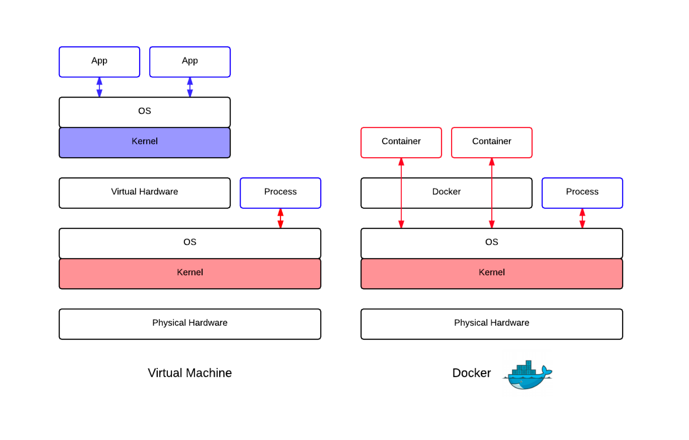
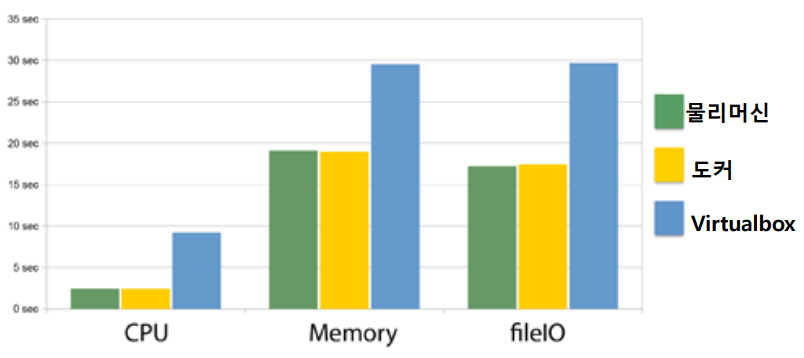

# Docker와 VM

> Docker와 VM의 차이

컨테이너와 VM(가상 머신)의 유사성 및 차이점에 대해 설명하고, 각각을 언제 사용해야 하는지 알아봅니다. 컨테이너와 VM은 용도가 서로 다릅니다. 실제로 대다수의 컨테이너 배포에서는 특히 클라우드에서 컨테이너를 실행할 때 VM을 하드웨어에서 직접 실행하는 대신 호스트 운영 체제로 사용합니다.

컨테이너는 기존의 가상화 기술인 가상 머신의 구현 방식과는 조금 다릅니다. **가상 머신**은 OS나 하이퍼바이저 위에서 하드웨어를 소프트웨어로 에뮬레이션하고 그 위에 OS를 실행하고, 다시 그 위에 프로세스를 실행합니다. 반면에 **컨테이너 가상화**는 하드웨어를 에뮬레이션하지 않고, 독립된 환경에서 실행된 것 처럼 보이는 특별한 제약이 가해진 프로세스를 실행합니다. 실제로 호스트 OS의 컨테이너는 단순히 호스트 OS의 프로세스입니다. **컨테이너는 도커 위에서 실행되는 것이 아니라, OS 위에서 실행되는 다른 프로세스들과 정확히 같은 계층에서 실행**됩니다.

## 컨테이너 아키텍처

컨테이너는 호스트 운영 체제에서 애플리케이션을 실행하기 위해 격리된 경량 사일로입니다. 컨테이너는 이 다이어그램에 표시된 것처럼 마치 호스트 운영 체제에 매립된 배관처럼 호스트 운영 체제의 커널 위에 빌드되며, 다음 다이어그램처럼 사용자 모드에서 실행되는 앱과 간단한 운영 체제 API 및 서비스만 포함합니다.

## 가상 컴퓨터 아키텍처

컨테이너와 달리, VM은 이 다이어그램에 표시된 것처럼 자체 커널을 포함한 완전한 운영 체제를 실행합니다.

#### 하드웨어 가상화 없는 격리된 환경에서 실행되는 **프로세스**

$$
컨테이너 = 프로세스
$$

## 컨테이너와 가상 머신 비교

다음 표에서는 이러한 보완 기술의 유사성 및 차이점을 보여줍니다.

| 기능   | 가상 머신                                                    | 컨테이너                                                     |
| :------------------------------- | :----------------------------------------------------------- | :----------------------------------------------------------- |
| 격리                             | 호스트 운영 체제와 기타 VM으로부터 완벽하게 격리합니다. 동일한 서버 또는 클러스터에 있는 경쟁 회사의 호스팅 앱처럼 강력한 보안 경계가 필요할 때 유용합니다. | 일반적으로 호스트 및 기타 컨테이너로부터 어느 정도 격리하지만, VM처럼 강력한 보안 경계를 제공하지는 않습니다. |
| 운영 체제                        | 커널을 포함하여 완전한 운영 체제를 실행하므로 더 많은 시스템 리소스(CPU, 메모리 및 스토리지)가 필요합니다. | 운영 체제의 프로세스로 실행하며, 앱에 필요한 서비스만 포함하도록 조정하여 시스템 리소스 사용을 줄일 수 있습니다. |
| 게스트 호환성                    | 가상 머신 내의 운영 체제에 대해서만 실행됩니다.              | 호스트와 동일한 운영 체제 버전에서 실행됩니다(윈도우 WSL환경에서는 WSL의 Linux환경에서 실행가능). |
| 운영 체제 업데이트 및 업그레이드 | 각 VM에 운영 체제 업데이트를 다운로드하여 설치합니다. 새 운영 체제 버전을 설치하려면 업그레이드가 필요하거나 경우에 따라 완전히 새로운 VM을 만들어야 합니다. 이렇게 하면 시간이 오래 걸리며, 특히 VM 수가 많으면 매우 긴 시간이 걸립니다. | 컨테이너 내의 운영 체제 파일을 업데이트 또는 업그레이드하는 방법은 다음과 같이 동일합니다. 최신 버전의 기본 이미지를 가리키도록 컨테이너 이미지의 빌드 파일(Dockerfile이라고도 함)을 편집합니다.이 새로운 기본 이미지를 사용하여 컨테이너 이미지를 다시 빌드합니다.컨테이너 레지스트리에 컨테이너 이미지를 푸시합니다. 배ㅐ포방법에 따라 재 배포를 시행합니다. |
| 영구 스토리지                    | 단일 VM의 경우 로컬 스토리지에 VHD(가상 하드 디스크)를 사용하고, 여러 서버에서 공유하는 스토리지에는 파일 공유를 사용합니다. | "-v" 또는 "--volume" 옵션을 추가하여 도커 컨테이너를 실행하면 공유 디렉터리를 연결할 수 있다.   docker -v \<host system directory>:\<container directory> [IMAGE NAME] |
| 부하 분산                        | 가상 머신 부하 분산은 실행 중인 VM을 장애 조치(failover) 클러스터의 다른 서버로 이동합니다. | 컨테이너 자체는 이동하지 않습니다. 대신 오케스트레이터는 클러스터 노드의 컨테이너를 자동으로 시작하거나 중지하여 부하 및 가용성의 변화를 관리할 수 있습니다. |
| 내결함성                         | VM은 클러스터의 다른 서버로 장애 조치할 수 있으며, 새 서버에서 VM의 운영 체제가 다시 시작됩니다. | 클러스터 노드에서 오류가 발생하면 오케스트레이터는 해당 노드에서 실행되는 모든 컨테이너를 신속하게 다른 클러스터 노드에 다시 만듭니다. |
| 네트워킹                         | 가상 네트워크 어댑터를 사용합니다.                           | 가상 네트워크 어댑터의 격리된 보기를 사용하며, 약간 적은 가상화를 제공합니다. 리소스를 적게 사용하지만 호스트의 방화벽을 컨테이너와 공유합니다 |

##  Overhead 비교

- “sysbench”라는 벤치 마크 도구를 사용하여 성능 측정
- 물리적 시스템과 컨테이너 형 가상화 성능은 모든 항목에서 거의 같은 결과
- 하드웨어 가상화는 메모리, 파일 IO는 약 2 배, CPU는 약 5 배의 시간
- 물리 머신과 비교해도 성능 저하가 거의 없음

## 마치며

이글을 통해 Docker가 최신이니 VM은 이전방식이니 이런 지나가는 이야기를 하고자 하는 것이 아니라 용도에 맞게 발전하고 있다는 것을 이야기 하고 싶다. 물리적인 하드웨어를 논리적으로 분할하기 위해서는 VM을 통해 분할하는 것은 오래된 이야기이고 AWS, Nutanix 등과 같이 기반 OS를 제공하는 방식으로, 컨테이너는 그 위의 서비스를 기본 OS로 부터 격리시키로 장애에 대비할 수 있도록하고 개발 편리를 제공하는 방식으로 나뉘어져 가고 있는 듯하다.