# 윈도우즈 도커 환경 만들기

> Windows 10환경에서 WSL2기반으로 도커환경 만들기

Docker를 사용하기 편한 방법으로 Windows 10기반에서 리눅스하위시스템을 사용하여 Docker를 구동하는 방법을 알아보고자 한다.

지난 5월 윈도우 10<sup>Windows 10</sup>의 대규모 업데이트가 있었습니다. 이번 윈도우 10 2020 5월 업데이트<sup>Windows 10 May 2020 Update</sup>는 2019년 11월 이후 첫 대규모 업데이트로 사용자를 위한 다양한 기능이 추가되었을 뿐만 아니라, 마이크로소프트<sup>Microsoft</sup>에서 미리 예고한 대로 WSL2<sup>Windows Subsystem for Linux 2</sup>를 포함하고 있습니다.

WSL은 윈도우에서 경량 가상화 기술을 사용해 리눅스를 구동할 수 있도록 도와주는 기능입니다. WSL2는 WSL을 대폭 개선해 훨씬 더 뛰어난 성능과 통합된 환경을 이용할 수 있습니다. 또한 윈도우 10 홈에서도 사용할 수 있어서, 홈 에디션에서도 도커Docker를 사용할 수 있게 되었습니다. 

이 글에서는 WSL2를 설치하고 기본적인 사용방법을 소개합니다. WSL2를 사용하려면 물론 윈도우 10 2020년 5월 업데이트를 먼저 진행해야합니다. 


## 윈도우 터미널(Windows Terminal) 설치하기

마이크로소프트<sup>Microsoft</sup>의 리눅스 지원 및 개발 도구 개선 속도가 무섭습니다. 2019년만 해도 여전히 도스 환경을 떠올리게 하던 cmd.exe(명령프롬프트)에서 벗어나지 못 했던 윈도우<sup>Windows</sup>의 터미널 작업 환경이 윈도우 터미널<sup>Windows Terminal</sup> 등장과 함께 빠르게 개선되고 있습니다. 이번 WSL2의 공식 릴리스와 보조를 맞추려는 듯 지난 5월 19일 마이크로소프트의 연례 컨퍼런스 빌드 2020<sup>Build 20202</sup>에서는 윈도우 터미널을 정식 릴리스 했습니다.

윈도우 터미널은 마이크로소프트 스토어<sup>Microsoft Store</sup> 앱에서 바로 다운로드 받아 사용할 수 있습니다. **Terminal**을 검색하고, 검색 결과에서 **Windows Terminal**을 선택합니다.

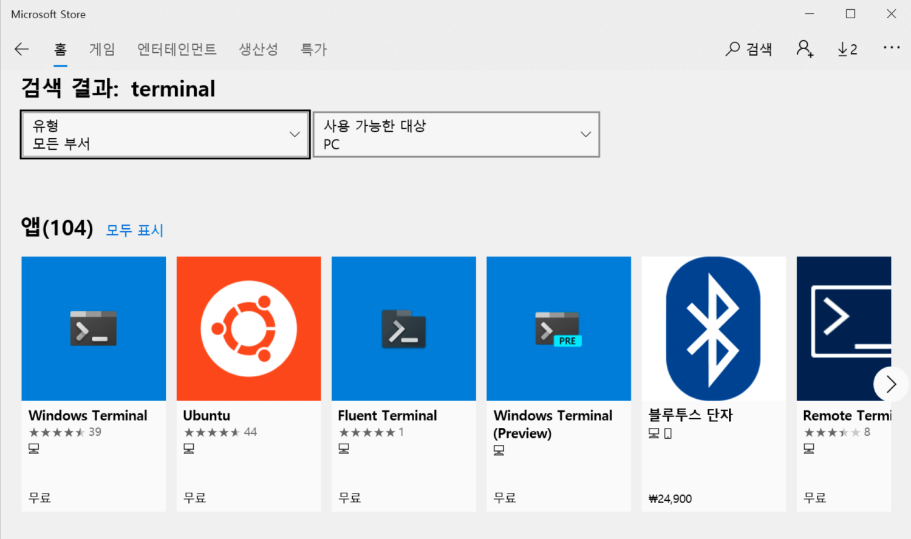


## WSL2 활성화를 위한 DISM 명령어 실행

윈도우 터미널처럼, WSL에서 사용할 리눅스 배포판도 마이크로소프트 스토어에서 손쉽게 다운로드 할 수 있습니다. 하지만 WSL2를 활성화하기 위해서는 그 이전에 몇 가지 작업을 진행해야합니다. 이에 대한 자세한 내용은 아래 공식 문서를 참고해주시기 바랍니다.

- [Install Windows Subsystem for Linux (WSL) on Windows 10 | Microsoft Docs](https://docs.microsoft.com/en-us/windows/wsl/install-win10)

먼저 윈도우 터미널(PowerShell)에서 다음 두 개의 명령어를 차례대로 실행해줍니다.

```powershell
> dism.exe /online /enable-feature /featurename:Microsoft-Windows-Subsystem-Linux /all /norestart
> dism.exe /online /enable-feature /featurename:VirtualMachinePlatform /all /norestart
```


DISM<sup>Deployment Image Servicing and Management</sup>은 윈도우 이미지<sup>Windows images</sup>와 관련된 조작을 위한 커맨드라인 명령어로, 이에 대한 자세한 정보는 [공식 문서](https://docs.microsoft.com/en-us/windows-hardware/manufacture/desktop/what-is-dism)의 정보를 참고해주세요.

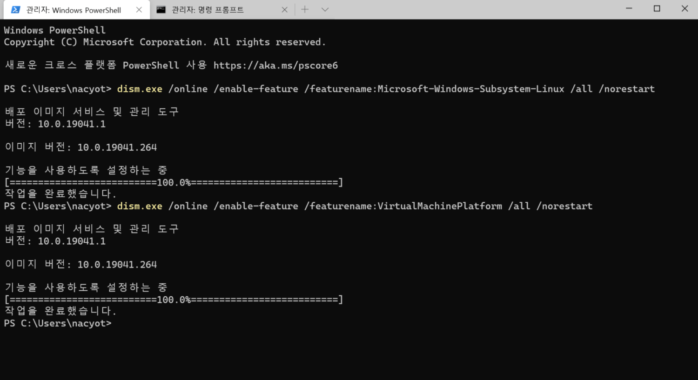

WSL을 관리하기 위해서 `wsl` 명령어를 사용해야하는데, 아직 동작하지 않습니다. 먼저 **재부팅**을 해줍니다.

---

[이 페이지를 브라우저에서 열면](https://aka.ms/wslstore) WSL에서 사용할 수 있는 리눅스 배포판을 다운로드 받을 수 있는 마이크로소프트 스토어 페이지로 이동합니다.

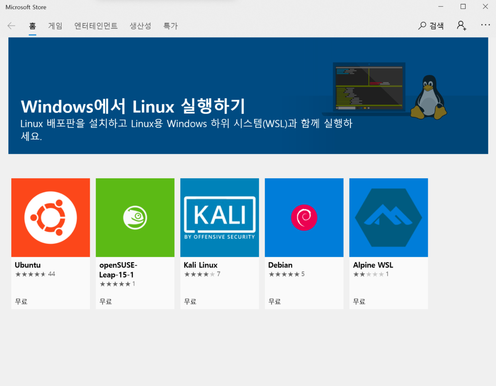리눅스 배포판을 다운로드 받을 수 있는 마이크로소프트 스토어 페이지

여기서는 우분투Ubuntu 배포판을 설치해보겠습니다. 우분투 배포판을 선택하고, 설치를 진행합니다.

우분투(Ubuntu) 배포판을 설치합니다

설치가 진행되는 걸 기다리고 있으면 곧 우분투 터미널 하나가 실행됩니다. 여기서 리눅스 사용자 이름과 패스워드를 지정해줍니다.*****

***** 설치를 몇 번 진행해보니 가끔 아무리 기다려도 터미널에 사용자 등록 화면이 뜨지 않는 경우가 있었습니다. 보통 5~10분이면 완료되는 듯 하니 너무 오래 응답이 없다면 재설치하는 것을 추천합니다.

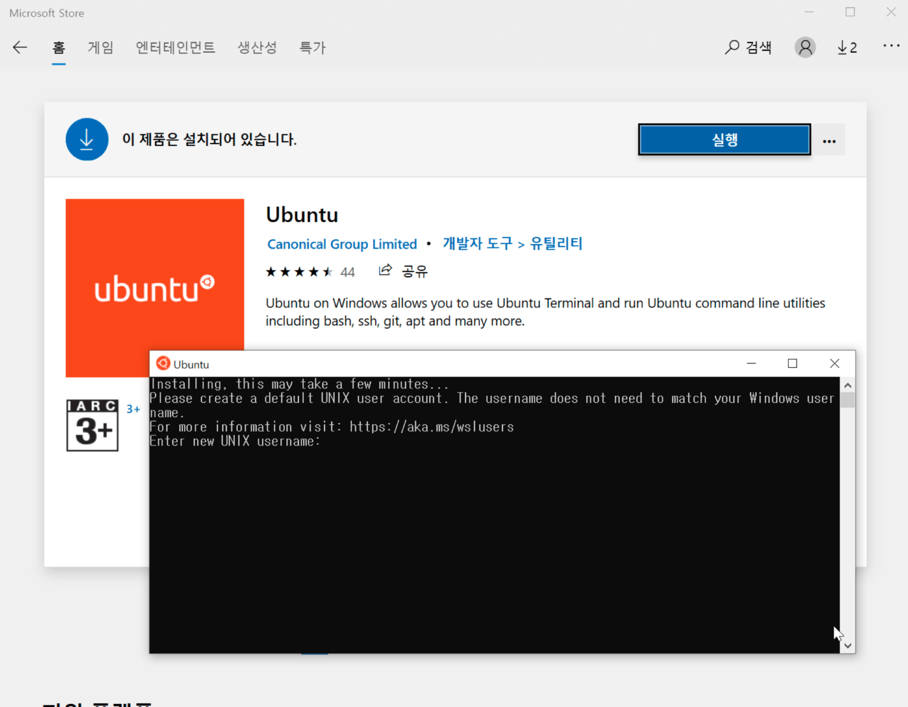우분투 배포판의 사용자 정보를 등록합니다

참고로 WSL에서는 우분투 이외에도 다양한 배포판을 공식적으로 지원하고 있습니다.

- [Ubuntu 16.04 LTS](https://www.microsoft.com/store/apps/9pjn388hp8c9)
- [Ubuntu 18.04 LTS](https://www.microsoft.com/store/apps/9N9TNGVNDL3Q)
- [Ubuntu 20.04 LTS](https://www.microsoft.com/store/apps/9n6svws3rx71)
- [openSUSE Leap 15.1](https://www.microsoft.com/store/apps/9NJFZK00FGKV)
- [SUSE Linux Enterprise Server 12 SP5](https://www.microsoft.com/store/apps/9MZ3D1TRP8T1)
- [SUSE Linux Enterprise Server 15 SP1](https://www.microsoft.com/store/apps/9PN498VPMF3Z)
- [Kali Linux](https://www.microsoft.com/store/apps/9PKR34TNCV07)
- [Debian GNU/Linux](https://www.microsoft.com/store/apps/9MSVKQC78PK6)
- [Fedora Remix for WSL](https://www.microsoft.com/store/apps/9n6gdm4k2hnc)
- [Pengwin](https://www.microsoft.com/store/apps/9NV1GV1PXZ6P)
- [Pengwin Enterprise](https://www.microsoft.com/store/apps/9N8LP0X93VCP)
- [Alpine WSL](https://www.microsoft.com/store/apps/9p804crf0395)

다시 `wsl` 명령어를 `-l` 옵션을 붙여 실행해보면 우분투 배포판이 설치된 것을 확인할 수 있습니다.

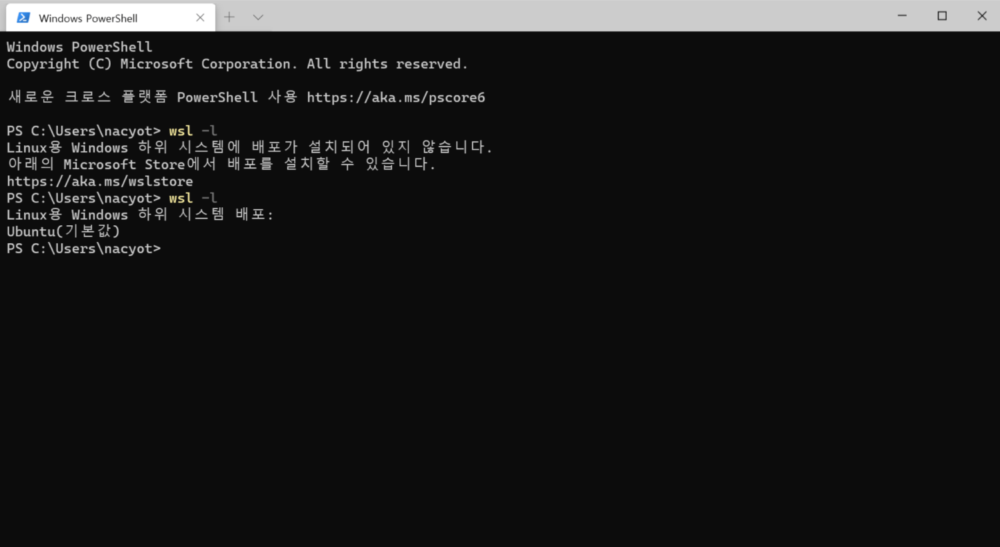wsl 명령어가 정상 동작하는 것을 확인할 수 있습니다.

이제 방금 설치한 Ubuntu 리눅스 배포판이 보이는 것을 확인할 수 있습니다.


## WSL2 리눅스 커널 업데이트 및 배포판에서 2 버전 활성화하기

WSL2를 활성화하기 전에 WSL2 리눅스 커널 업데이트를 진행해야합니다. 다음 페이지에서 **download the latest WSL2 Linux kernel**를 링크를 클릭해 설치를 진행합니다.

- [Updating the WSL 2 Linux Kernal | Microsoft Docs](https://docs.microsoft.com/ko-kr/windows/wsl/wsl2-kernel)

다음으로 앞서 설치한 배포판에 WSL2가 적용되었는지 꼭 확인해야합니다. 현재 윈도우 10에서는 WSL(1)과 WSL2를 모두 `wsl` 명령어로 지원하고 있습니다. `wsl -l -v` 명령어를 실행해서 현재 적용된 WSL 버전을 확인해봅니다.

```
> wsl -l -v
  Name           State         Version
* Ubuntu         Running       1
```

1이라고 나오면 다음 명령어로 2로 변경할 수 있습니다.

```
> wsl --set-version Ubuntu 2
```

가능하면 새로 설치하는 모든 배포판에 WSL2가 적용되도록 기본값을 변경해주시기 바랍니다. **사용해본결과 무조건 Version 2로**

```
> wsl --set-default-version 2
```

자동으로 2 버전이 적용될 것 같지만, 혹시 모르니 강제로 한 번 종료해줍니다. 자동으로 재실행됩니다.

```
> wsl -t Ubuntu
```

다시 한 번 WSL2가 적용되었는지 확인해봅니다.

```
> wsl -l -v
  Name           State         Version
* Ubuntu         Running       2
```

WSL를 사용하면 `wsl` 명령어를 은근히 많이 사용하게 됩니다. 이 명령어에 대한 자세한 사용법은 `--help`를 붙여서 실행해보거나, 마이크로소프트의 공식 문서를 참고해주세요.

- [Windows interoperability with Linux | Microsoft Docs](https://docs.microsoft.com/en-us/windows/wsl/interop)
- [Windows Subsystem for Linux Command Reference | Microsoft Docs](https://docs.microsoft.com/en-us/windows/wsl/reference)


## WSL2에서 우분투(Ubuntu) 시작하기

WSL2를 시작하기까지 생각보다 해야할 일이 많네요. 자 이제 전부 끝났습니다. 윈도우 터미널에서 새 탭 오른쪽의 아래쪽 방향 아이콘을 클릭하고, Ubuntu를 선택해주면 앞서 셋업한 WSL2 우분투 배포판 셸이 실행됩니다.

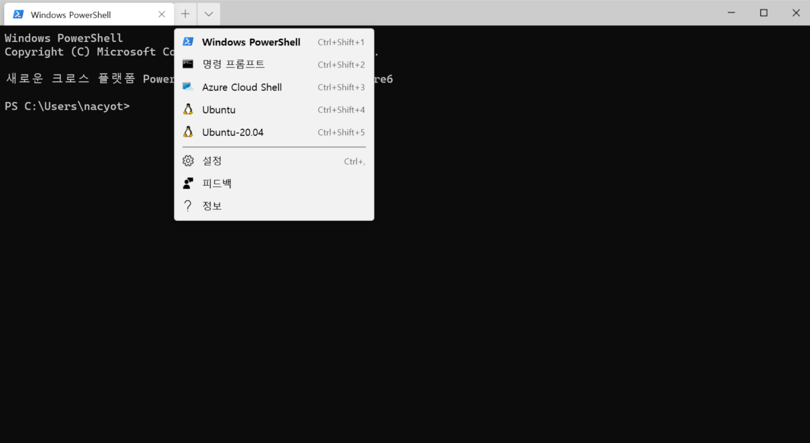WSL2 우분투로 새로운 탭을 열 수 있습니다

리눅스 셸이 열립니다. 이제 윈도우에서 리눅스를 사용하기만 하면됩니다!


## WSL2에서 도커 데스크탑(Docker Desktop for Windows)으로 서버 실행하기

여기서는 WSL2을 활용하는 간단한 예제로, 도커 데스크탑Docker Desktop for Windows을 설치하고 Nginx 서버를 하나 실행해보겠습니다.

> **도커(Docker)는?**
>
> 도커Docker는 컨테이너 관리 도구입니다. 리눅스 커널의 기능을 활용해 프로세스를 격리된 환경에서 실행하는 걸 컨테이너라고 부릅니다. 도커는 애플리케이션 배포부터 개발 환경 구성에 사용될 뿐만 아니라, 미리 만들어진 이미지를 활용하기도 좋아서 개발자가 아닌 분들도 사용하곤 합니다. WSL이 등장할 때도 도커 지원 여부가 큰 화두 중 하나였는데, WSL1에서도 도커를 실행하는 게 가능했다고 하지만, 성능 및 호환성 문제로 활용하기가 쉽지 않았습니다.

도커의 기초에 대해서는 다음 글을 참고해주세요.

- [도커(Docker) 입문편: 컨테이너 기초부터 서버 배포까지 | 44BITS](https://www.44bits.io/ko/post/easy-deploy-with-docker)

먼저 도커 데스크탑 페이지로 이동해 설치를 진행합니다.

- [Docker Desktop for Windows - Docker Hub](https://hub.docker.com/editions/community/docker-ce-desktop-windows)

도커 데스크탑을 설치하고 설정 페이지의 **General** 탭에서 **Use the WSL2 based engine** 옵션을 체크해줍니다.

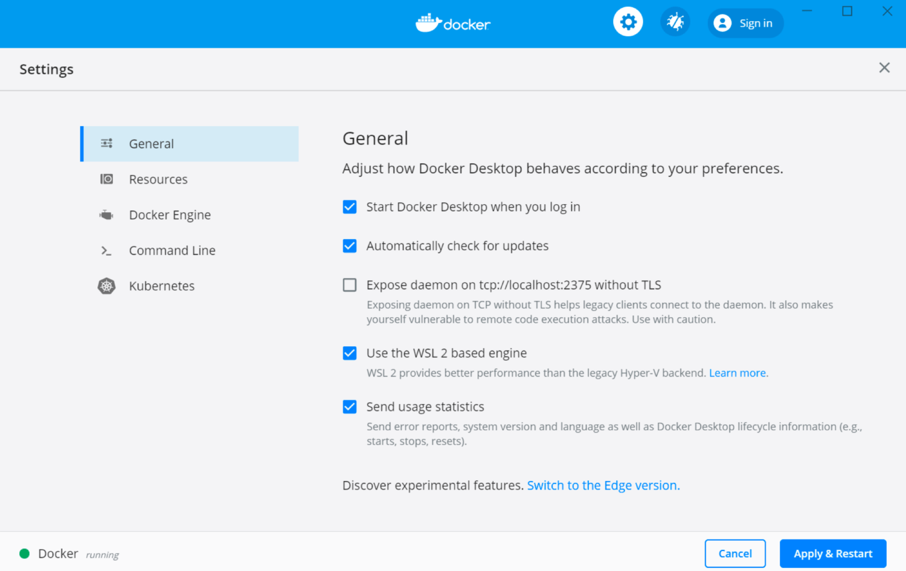Use the WSL2 based engine 옵션을 체크해줍니다

Resource -> WSL Integration 페이지로 이동해서 설정을 확인합니다. 자신이 사용중인 WSL2 배포판이 맞는지 확인합니다.

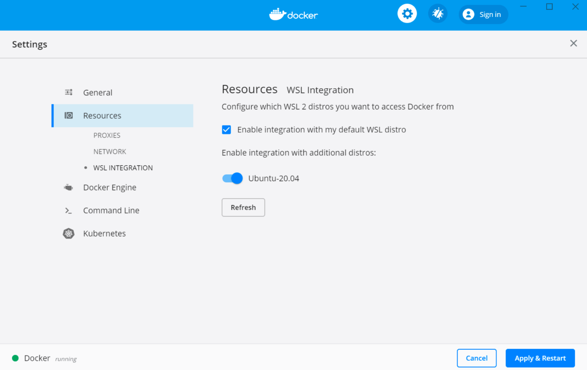Resource -> WSL Integration에서 활성화된 리눅스 배포판을 확인합니다

도커 데스크탑을 설치하고 정상적으로 설정되어있다면, 바로 WSL2 우분투 터미널에서 도커 명령어를 사용할 수 있습니다.

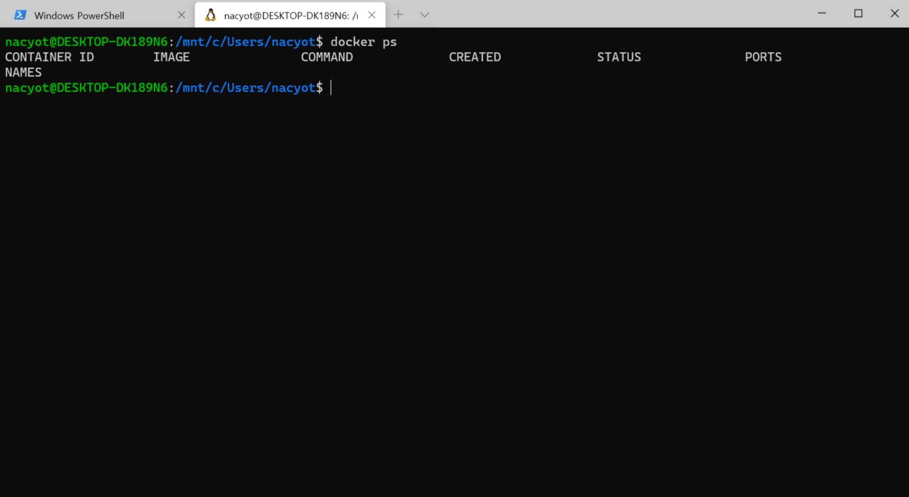WSL2 우분투에서 docker ps를 실행한 결과

`docker ps` 명령어로 도커가 실행중인 것을 확인할 수 있습니다. `ip addr show eth0` 명령어로 WSL2 우분투의 IP 주소를 확인합니다.

```
$ ip addr show eth0
4: eth0: <BROADCAST,MULTICAST,UP,LOWER_UP> mtu 1500 qdisc mq state UP group default qlen 1000
    link/ether 00:15:5d:43:a5:bc brd ff:ff:ff:ff:ff:ff
    inet 172.27.91.145/20 brd 172.27.95.255 scope global eth0
       valid_lft forever preferred_lft forever
    inet6 fe80::215:5dff:fe43:a5bc/64 scope link
       valid_lft forever preferred_lft forever
```

여기서는 `172.27.91.145`가 나옵니다. WSL2의 네트워크는 Hyper-V 가상화 기반으로 동작하고 있어서 부득이하게 이 IP는 재부팅 시 변경되어 버리니 주의가 필요합니다.

노트

> ip vs. ifconfig
>
> 현재 리눅스의 네트워크 관리는 iproute2 패키지의 ip와 ss 명령어로 거의 대부분 수행 가능하다고 합니다. 오래된 도구보다는 ip를 사용하는 걸 추천드립니다. 자세한 내용은 다음 글을 참고해주세요.
>
> - [If you’re still using ifconfig, you’re living in the past | Ubuntu](https://ubuntu.com/blog/if-youre-still-using-ifconfig-youre-living-in-the-past)

이제 도커로 Nginx 서버를 실행해보겠습니다.

```
$ docker run -it -p 80:80 nginx:latest
```

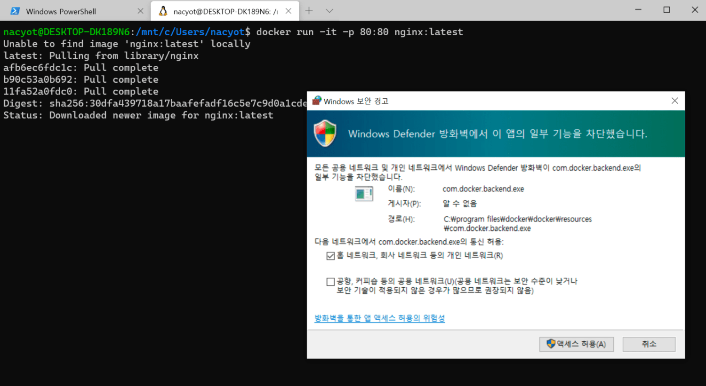도커로 Nginx 서버를 실행합니다

도커로 Nginx 이미지로 컨테이너를 실행합니다. 이미지를 풀 받고 서버가 실행되면 방화병에서 포트를 허용할 것인지 물어봅니다. 액세스 허용을 클릭하면 이제 윈도우에서 이 서버로 접속하는 것이 가능합니다. 브라우저를 열어 앞서 확인해둔 IP로 접속해봅니다.

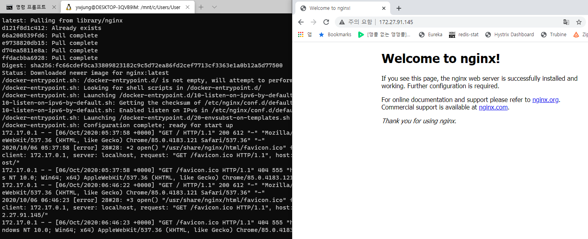

Nginx 서버에 정상적으로 접속되는 것을 확인할 수 있습니다

**Welcome to nginx!** 메시지로 도커로 실행한 서버에 정상 접속한 것을 확인할 수 있습니다. 도커 컨테이너 쪽에도 접속한 기록이 나타납니다. 고유 IP로 접근 가능하다는 것을 확인하기 위해서 IP를 사용했습니다만, 호스트 머신에서는 `127.0.0.1`로 접속해도 같은 서버에 접속이 됩니다.

호스트 머신에서 접근하는 것은 쉽습니다만, 이 서버를 로컬 네트워크 환경에 노출 시키는 건 생각보다 어려워보입니다. 다음 이슈를 참고해주세요.

- [WSL 2 - NIC Bridge mode (Has TCP Workaround🔨) · Issue #4150 · microsoft/WSL](https://github.com/microsoft/WSL/issues/4150)


## 마치며

여기까지 WSL2를 설치하고, 기본적인 사용법에 대해서 알아보았습니다. 윈도우에서 리눅스를 이렇게까지 자연스럽게 사용할 수 있게 되다니 격세지감이 느껴지네요. WSL2는 이제 막 시작일 뿐입니다. 마이크로소프트에서는 이번 빌드 2020에서 새로운 로드맵을 발표해 사람들을 놀라게 했습니다. 조만간 윈도우 10에서 WSL2로 리눅스의 GUI를 지원할 뿐만 아니라, GPU 처리도 지원할 예정이라고 합니다.

- [“진짜 리눅스에 가까워지는 윈도우 10” WSL2도 GUI 지원 - ITWorld Korea](http://www.itworld.co.kr/news/153272)
- [The Windows Subsystem for Linux BUILD 2020 Summary | Windows Command Line](https://devblogs.microsoft.com/commandline/the-windows-subsystem-for-linux-build-2020-summary/)
- [Getting started with CUDA on Ubuntu on WSL 2](https://ubuntu.com/blog/getting-started-with-cuda-on-ubuntu-on-wsl-2)