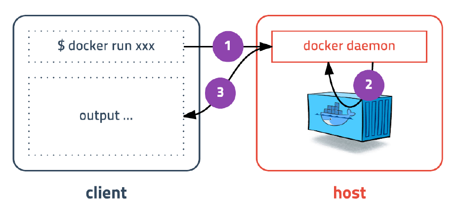

# Docker 사용하기

> Docker를 사용해보기


Docker는 기본적으로 Client(command, CLI) -Server(daemon)으로구성되어 있습니다.




## 컨테이너 실행하기

### run command

```shell
docker run [OPTIONS] IMAGE[:TAG|@DIGEST] [COMMAND] [ARG...]
```

> 옵션 설명
> ‑d detached mode 흔히 말하는 백그라운드 모드
> ‑p 호스트와 컨테이너의 포트를 연결 (포워딩)
> ‑v 호스트와 컨테이너의 디렉토리를 연결 (마운트)
> ‑e 컨테이너 내에서 사용할 환경변수 설정
> ‑‑name 컨테이너 이름 설정
> ‑‑rm 프로세스 종료시 컨테이너 자동 제거
> ‑it ‑i와 ‑t를 동시에 사용한 것으로 터미널 입력을 위한 옵션
> ‑‑network 네트워크 연결

### ubuntu 16.04 컨테이너 실행하기

```shell
$ docker run ubuntu:16.04
```

> run명령어 를 사용하면 사용할 이미지가 저장되어 있는지 확인하고 없다면 다운로드( pull )를 한후 컨테이너를 생성( create )하고 시작( start ) 합니다.
> 컨테이너는 정상적으로 실행됐지만 뭘 하라고 명령어를 전달하지 않았기 때문에 컨테이너는 생성되자마자 종료됩니다. 컨테이너는 프로세스이기 때문에 실행중인 프로세스가 없으면 컨테이너는 종료됩니다.

### 컨테이너 내부의 /bin/sh 실행하기

```shell
$ docker run --rm -it ubuntu:16.04 /bin/sh
```

> 컨테이너 내부에 들어가기 위해 sh 을 실행하고 키보드 입력을 위해 -it (== ‑i ‑t) 옵션을 줍니다. 추가적으로 프로세스가 종료되면 컨테이너가 자동으로 삭제되도록 --rm 옵션도 추가하였습니다. --rm 옵션이 없다면 컨테이너 종료되더라도 삭제되지 않고 남아있습니다.

### 간단한 Web Application 실행해 보기

간단한 웹 애플리케이션을 컨테이너로 생성해봅니다.

```Shell
$ docker run -d -p 4567:4567 subicura/docker-workshop-app:1
```

> detached mode(백그라운드 모드) 로 실행하기 위해 -d 옵션을 추가하,고 -p 옵션을 추가하여 컨테이너의 포트(뒤)를 호스트의 포트(앞)로 연결하였습니다.

브라우저를 열고 localhost:4567 에 접속하면 컨테이너 아이디를 확인 할 수 있습니다.
curl 명령어로 확인해볼까요?  &#8592; 자신의 Container Id 표시

```shell
$ curl localhost:4567 
```


### 환경 변수 전달 방법

-e 옵션을 통해 환경변수 값을 전달할수 있습니다.

```Shell
$ docker run -d \
  -p 4568:4567 \
  -e ENDPOINT=https://workshop-docker-kr.herokuapp.com/ \
  -e PARAM_NAME=haha \
  subicura/docker-workshop-app:2
```


### Redis 실행해보기

redis는 메모리기반의 다양한 기능을 가진 스토리지입니다.

```shell
$ docker run --name=redis -d -p 1234:6379 redis
```


### MySQL 실행해보기

가장 유명한 데이터베이스 중 하나입니다. docker hub mysql을 검색해서 어떤 옵션(환경변수)이 있
는지 확인해 봅니다.

```Shell
$ docker run -d -p 3306:3306 \
  -e MYSQL_ALLOW_EMPTY_PASSWORD=true \
  --name mysql \
  mysql:5.7
```

#### mysql에 접속하여 database를 만듭니다.

```Shell
$ docker exec -it mysql mysql
create database wp CHARACTER SET utf8;
grant all privileges on wp.* to wp@'%' identified by 'wp';
flush privileges;
quit
```


### exec 명령어

잠깐! exec 명령어를 사용했습니다. exec 명령어는 run 명령어와 달리 실행중인 도커 컨테이너에
접속할 때 사용하며 일반적으로 컨테이너 안에 ssh server등을 설치하지 않고 exec명령어로 접속합
니다.

### WordPress 실행해보기

워드프레스를 실행합니다.

```Shell
# windows 사용자는 docker.for.mac.localhost 대신 docker.for.win.localhost를 입력해주세요.
# 이미지의 호스트에 아이피가 필요한데 이것을 모르기 때문에 도커에서 제공하는 docker.for.mac.localhost or  docker.for.win.localhost 라는 dns을 사용해서 접속 가능하다.

$ docker run -d -p 8080:80 \
  -e WORDPRESS_DB_HOST=docker.for.win.localhost \
  -e WORDPRESS_DB_NAME=wp \
  -e WORDPRESS_DB_USER=wp \
  -e WORDPRESS_DB_PASSWORD=wp \
  wordpress
```

컨테이너가 제대로 실행되었는지 웹 브라우저로 확인해봅니다.

```shell
localhost:8080
```


### ps 명령어

실행중인 컨테이너 목록을 확인하는 명령어는 다음과 같습니다.

```Shell
docker ps
```


중지된 컨테이너도 확인하려면 -a 옵션을 붙입니다.

```Shell
docker ps -a
```

Docker의 Container는 **실행(run)**을 하면 **실행중인 컨테이너 목록(ps)에서 확인**이 되고, **중지(stop)**를 하면 **중지된 컨테이너도 확인(ps -a)에서 확인**이 가능하고 이 **중지된것을 컨테이너 목록에서 삭제하려면 rm명령을 통해 완전히 삭제**를 해야합니다.


### stop 명령어

실행중인 컨테이너를 중지하는 명령어는 다음과 같습니다.

```Shell
docker stop [OPTIONS] CONTAINER [CONTAINER...]
```


실행중인 컨테이너를 하나 또는 여러개 (띄어쓰기로 구분) 중지할 수 있습니다.

### rm 명령어

종료된 컨테이너를 완전히 제거하는 명령어는 다음과 같습니다.

```Shell
docker rm [OPTIONS] CONTAINER [CONTAINER...]
```


삭제 명령어도 옵션은 특별한게 없습니다. 종료된 컨테이너를 하나 또는 여러개 삭제할 수 있습니다.

* mysql 과 wordpress 를 제외하고 모두 삭제해주세요.


### logs 명령어

컨테이너가 정상적으로 동작하는지 확인하는 좋은 방법은 로그를 확인하는 것 입니다. 로그를 확인
하는 방법은 다음과 같습니다.

```Shell
docker logs [OPTIONS] CONTAINER
```

기본 옵션과 -f옵션을 살펴봅니다.


### images 명령어

도커가 다운로드한 이미지 목록을 보는 명령어는 다음과 같습니다.

```Shell
docker images [OPTIONS] [REPOSITORY[:TAG]]
```

간단하게 도커 이미지 목록을 확인해보겠습니다.

```Shell
docker images
```


### pull 명령어

이미지를 다운로드하는 명령어는 다음과 같습니다.

```Shell
docker pull [OPTIONS] NAME[:TAG|@DIGEST]
```

ubuntu:14.04를 다운받아보겠습니다.

```Shell
docker pull ubuntu:14.04
```


run명령어를 입력하면 이미지가 없을 때 자동으로 다운받으니 pull명령어를 언제 쓰는지 궁금할 수 있는데 pull은 최신버전으로 다시 다운 받습니다. 같은 태그지만 이미지가 업데이트 된 경우는 pull 명령어를 통해 새로 다운받을 수 있습니다.


### rmi 명령어

이미지를 삭제하는 방법은 다음과 같습니다.

```Shell
docker rmi [OPTIONS] IMAGE [IMAGE...]
```

images명령어를 통해 얻은 이미지 목록에서 이미지 ID를 입력하면 삭제가 됩니다. 단, 컨테이너가 실행중인 이미지는 삭제되지 않습니다. 컨테이너는 이미지들의 레이어를 기반으로 실행중이므로 당연히 삭제할 수 없습니다.


### network create 명령어
도커 컨테이너끼리 통신을 할 수 있는 가상 네트워크를 만듭니다.

```Shell
docker network create [OPTIONS] NETWORK
```

app-network 라는 이름으로 wordpress와 mysql이 통신할 네트워크를 만듭니다.

```Shell
docker network create app-network
```


### network connect 명령어

기존에 생성된 컨테이너에 네트워크를 추가합니다.

```Shell
docker network connect [OPTIONS] NETWORK CONTAINER
```

만들어 놓은 mysql에 네트워크를 추가합니다.

```Shell
docker network connect app-network mysql
```


### 실행시 nettwork를 설정하는 방법(run with network)

워드프레스를 app‑network에 속하게 생성하고 mysql을 IP가 아닌 mysql 로 바로 접근합니다.

```Shell
docker run -d -p 8080:80 \
  --name=wordpress_test \
  --network=app-network \
  -e WORDPRESS_DB_HOST=mysql \
  -e WORDPRESS_DB_NAME=wp \
  -e WORDPRESS_DB_USER=wp \
  -e WORDPRESS_DB_PASSWORD=wp \
  wordpress
```


같은 네트워크에 속해 있으면 상대 컨테이너의 이름(docker ps의 NAMES)을 DNS로 조회하여 바로 접근 할 수 있습니다. 하나의 컨테이너는 여러개의 network에 속할 수 있으며 Docker Swarm 같은 클러스터에서 편리하게 사용할 수 있습니다.

### 볼륨 마운트 :  volume mount (-v)

mysql을 삭제후에 다시 실행합니다.

```Shell
docker stop mysql
docker rm mysql
docker run -d -p 3306:3306 \
-e MYSQL_ALLOW_EMPTY_PASSWORD=true \
--network=app-network \
--name mysql \
mysql:5.7
```

워드프레스를 접속하면 데이터베이스 오류가 발생합니다. 이전 데이터가 전부 초기화 되었습니다!

```Shell
localhost:8080
```

container를 삭제하면 데이터도 했던 작업도 모두사라지게 됩니다.  그래서 host의 디스크를 container로 mount해서 데이터를 아래와 같이 설정하여 보존할 수 있도록 할 수 있습니다. 이는 뒤에서 실제 예를 보도록 하겠습니다.(host directory:container directory)

```Shell
volumes:
- ./mysql:/var/lib/mysql
```


---

이제까지 보면 하나의 container를 실행하고 network으로 연결는 등의 방법을 사용했는데, 실제 업무에서는 여러개의 서버스를 구성하여 구동하는 등 복잡한 업무들이 발생하고 지금과 같이 하나하나 처리하기에는 어려움이 있을 것입니다. 그래서 이러한것을 한꺼번에 할 수 있는 방법으로 docker-compose를 알아보고자 합니다.

## Docker Compose

### 설치확인

Docker for Mac / Windows는 기본으로 같이 설치됩니다.
$ docker-compose version

```노디ㅣ
docker-compose version 1.27.4, build 40524192
docker-py version: 4.3.1
CPython version: 3.7.7
OpenSSL version: OpenSSL 1.1.0l  10 Sep 2019
```

Linux는 다음 명령어로 설치합니다.

```shell
sudo curl -L https://github.com/docker/compose/releases/download/1.27.4/docker-compose-`uname -s`-`u
sudo chmod +x /usr/local/bin/docker-compose
```


### Docker-compose 설정파일 만들기 : docker-compose.yml

볼륨 마운트 옵션을 넣어서 wordpress와 database를 만듭니다.

```yaml
version: '2'
services:
  db:
    image: mysql:5.7
      volumes:
        - ./mysql:/var/lib/mysql
    restart: always
    environment:
      MYSQL_ROOT_PASSWORD: wordpress
      MYSQL_DATABASE: wordpress
      MYSQL_USER: wordpress
      MYSQL_PASSWORD: wordpress
  wordpress:
    image: wordpress:latest
    volumes:
      - ./wp:/var/www/html
    ports:
      - "8000:80"
    restart: always
    environment:
      WORDPRESS_DB_HOST: db:3306
      WORDPRESS_DB_PASSWORD: wordpress
```


### 시작 : up

docker compose를 이용하여 mysql와 wordpress를 실행합니다.

```She
docker-compose up -d
```


###  종료: down

docker compose를 이용하여 mysql와 wordpress를 종료합니다.

```Shell
docker-compose down
```


실제 운영환경에선 명령어를 입력하는 대신 대부분 Docker Compose를 사용합니다. Docker
Compose는 docker의 거의 모든 기능을 사용할 수 있습니다.