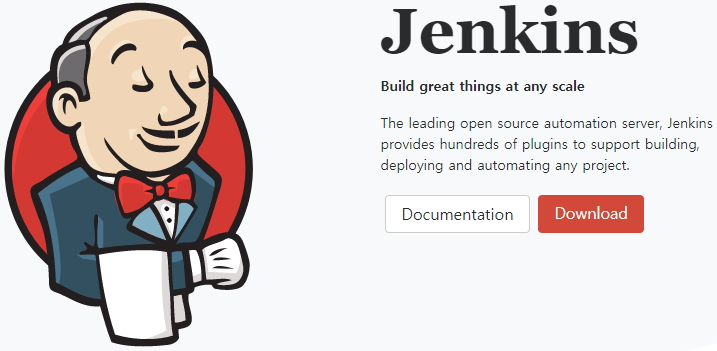
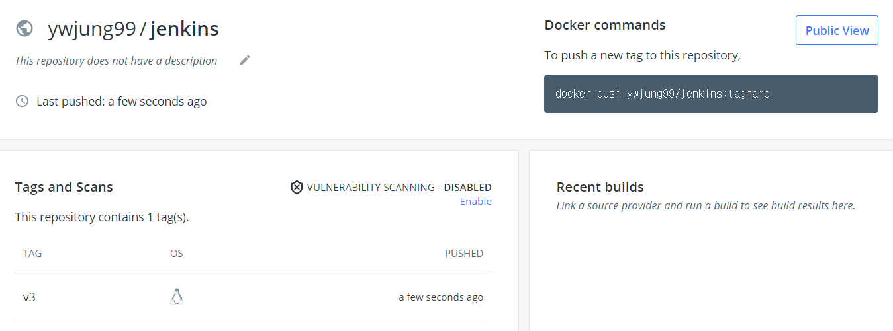
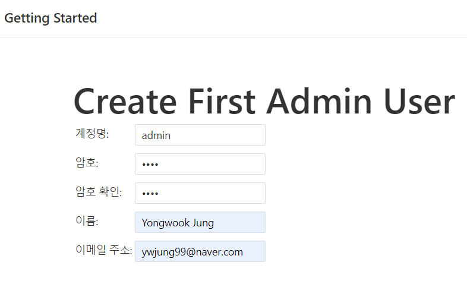
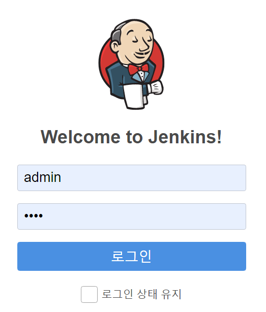
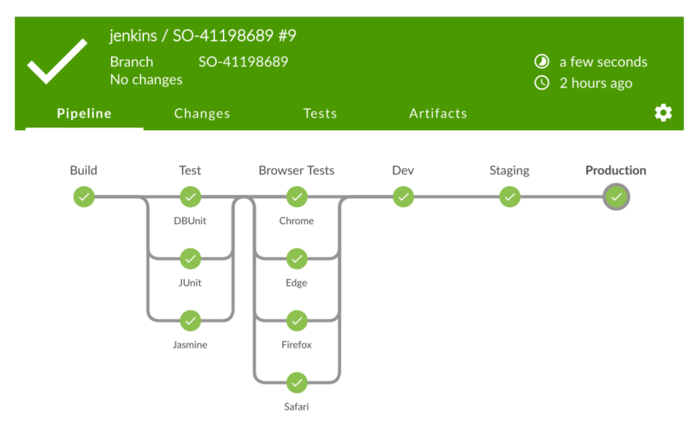
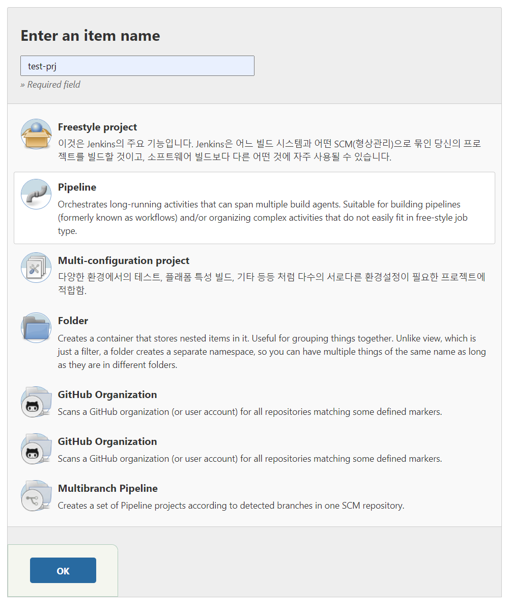
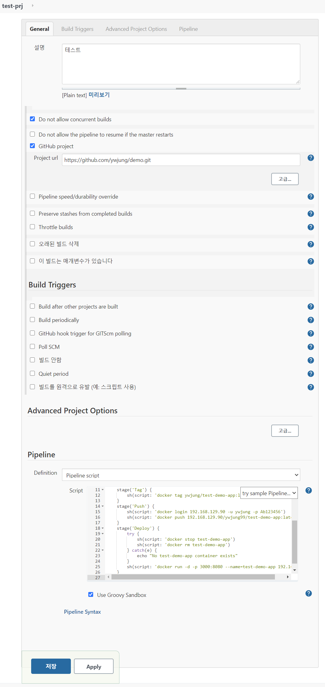
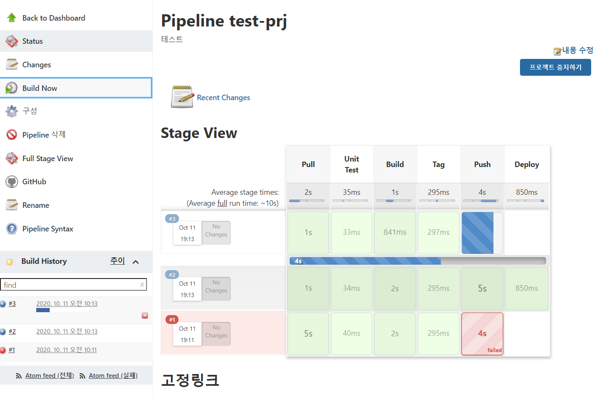
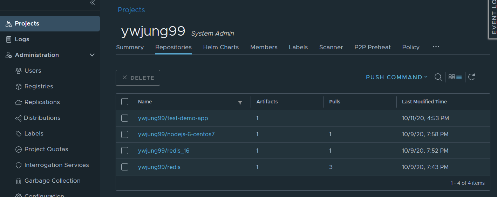
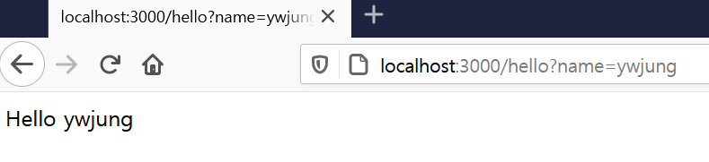

# 도커 이미지 자동 배포 하기

> 지속적 통합 및 전달(CI/CD)
> Jenkins 소개
> Jenkins 실행하기
> 자동 배포 스크립트 만들기
> 실제 사례

## CI/CD

- CI Continuous Integration
- CD Continuous Delivery

빠르고 효과적으로 제품을 출시하기 위해 지속적으로 소스를 통합하고 빌드하고 테스트하고 배포하는 과정이 필요합니다.
CI는 보통 테스트/빌드까지의 과정을 이야기하고 CD는 추가로 전달/배포까지 포함합니다. 하지만 혼용해서 쓰는 경우가 많고 CI라도 배포까지 포함하는 경우가 있습니다.


### 도커를 이용해 제품을 배포하는 과정

1. 소스저장소에 최신 소스를 저장
2. 전체 소스를 다운로드
3. 테스트
4. Docker 이미지 만들기(Build)
5. Docker 이미지 저장하기(Push)
6. 애플리케이션 업데이트(Pull)

> 2~6은 자동화

1. **`소스저장소에 최신 소스를 저장(개발자는 여기까지만 신경씁니다)`**

2. ~~전체 소스를 다운로드~~

3. ~~테스트~~

4. ~~Docker 이미지 만들기(Build)~~

5. ~~Docker 이미지 저장하기(Push)~~

6. ~~애플리케이션 업데이트(Pull)~~

   

### 실습
샘플소스(https://github.com/subicura/docker‑jenkins‑workshop)를 가지고 자동으로 이미지를 만 들고 배포하는 방법을 실습합니다. 

```Shell
$ git clone https://github.com/subicura/docker-jenkins-workshop
Cloning into 'docker-jenkins-workshop'...
remote: Enumerating objects: 41, done.
remote: Total 41 (delta 0), reused 0 (delta 0), pack-reused 41
Unpacking objects: 100% (41/41), 4.61 KiB | 393.00 KiB/s, done.
```

sinatra(ruby) 로 만들어진 웹 애플리케이션이며 / 또는 /hello 로 접속할 수 있습니다.

### 자동화 도구들 

- **Jenkins **
- TravisCI 
- CircleCI
-  그외 다양한 도구들


## Jenkins

젠킨스는 2004년 썬 마이크로시스템즈에서 코스케 가와구치의  허드슨 프로젝트를 통해 시작되었으며 2011년 젠킨스란 이름으로 세상에 소개되었다. 



자바 기반 웹 어플리케이션으로 CI(Continuous Integration 지속적 통합),  CD(Continuous Delivery 지속적 배포)을 위한 도구입니다.

위에서 지속적이라는 의미는 "**수시 반복수행**"한다는 의미를 내포하고 있다. 해석해보면 수시로 반복수행하면서 통합하고 빌드/배포할 수 있도록 지원하는 것을 말한다.

- 빌드 / 테스트 / 코드 분석 / 배포 / 알람등 다양한 기능 제공
- Master / Agent 구성 (하나의 Master에 수십 / 수백개의 Agent 사용가능) 
- 1,400여개가 넘는 플러그인 제공


### Jenkins 실행 

기본 Jenkins 프로젝트에 docker와 docker‑compose가 설치된 도커 이미지를 사용하며 이 이미지는 docker hub에 만들어 두었습니다.



* 이미지 만드는 자료는 첨부 내용을 참조하세요.


#### 실행

```Shell
$ docker run -u root --rm -p 9595:8080 --name jenkins_home -v /home/jenkins_home:/var/jenkins_home -v /var/run/docker.sock:/var/run/docker.sock ywjung99/jenkins:v3
Running from: /usr/share/jenkins/jenkins.war
webroot: EnvVars.masterEnvVars.get("JENKINS_HOME")
2020-10-11 09:18:08.893+0000 [id=1]     INFO    org.eclipse.jetty.util.log.Log#initialized: Logging initialized @244ms to org.eclipse.jetty.util.log.JavaUtilLog
...
2020-10-11 09:18:13.436+0000 [id=29]    INFO    o.s.b.f.s.DefaultListableBeanFactory#preInstantiateSingletons: Pre-instantiating singletons in org.springframework.beans.factory.support.DefaultListableBeanFactory@3a32129: defining beans [filter,legacy]; root of factory hierarchy
2020-10-11 09:18:13.615+0000 [id=29]    INFO    jenkins.install.SetupWizard#init:

*************************************************************
*************************************************************
*************************************************************

Jenkins initial setup is required. An admin user has been created and a password generated.
Please use the following password to proceed to installation:

31e4ad0a8a6a40ae8d95cd8fb722a3fb

This may also be found at: /var/jenkins_home/secrets/initialAdminPassword

*************************************************************
*************************************************************
*************************************************************

2020-10-11 09:18:20.167+0000 [id=29]    INFO    jenkins.InitReactorRunner$1#onAttained: Completed initialization
2020-10-11 09:18:20.177+0000 [id=21]    INFO    hudson.WebAppMain$3#run: Jenkins is fully up and running
```


### Jenkins 접속 

1. http://localhost:9595접속 후 로그에 적힌 패스워드를 입력합니다.

2. Install suggested plugins을 선택해서 플러그인을 설치한다.

3. Create First Admin User에서 관리자 계정을 생성후 `Save and Continue`를 클릭한다.



4. Instance Configuration에서 `Save and Finish`를 클릭하면 완료 된다. 그후 http://localhost:9595으로 재접속 한다.




### Jenkins  작업 만들기

작업의 종류는 다양하지만 여기서는 pipeline을 이용해서 작업을 생성합니다. stage 별로 작업을 만들 수 있습니다. `groovy 언어`를 사용합니다.



작업들이 pipeline에 연결되어 진행되는 것처럼 보이는 것으로 첫번째 Build, 두번째 Test 해서 여섯번째 Production 배포 까지 연결되어 있습니다. 이것을 참고해서 Build하고 배포하는 pipeline을 만들어 보겠습니다.


#### 새로운 Item 만들기

왼쪽의 `새로운 Item`또는 중앙에서 `새작업`을 클릭합니다.


Item이름을 `작성(test-prj)`하고 구성방식을 `Pipeline`을 선택합니다.



Pipeline 구성을 아래와 같이 합니다. pipeline script는 아래 스크립트를 참고합니다.



pipeline script

```json
node {
    stage('Pull') {
        git 'https://github.com/ywjung/demo.git'
    }
    stage('Unit Test') {
        echo "Unit Tested!"
    }
    stage('Build') {
        sh(script: 'docker build --force-rm=true -t ywjung/test-demo-app:latest .')
    }
    stage('Tag') {
        sh(script: 'docker tag ywjung/test-demo-app:latest 192.168.129.90/ywjung99/test-demo-app:latest')
    }
    stage('Push') {
        sh(script: 'docker login 192.168.129.90 -u ywjung -p Ab123456')
        sh(script: 'docker push 192.168.129.90/ywjung99/test-demo-app:latest')
    }
    stage('Deploy') {
        try {
            sh(script: 'docker stop test-demo-app')
            sh(script: 'docker rm test-demo-app')
        } catch(e) {
            echo "No test-demo-app container exists"
        }
        sh(script: 'docker run -d -p 3000:8080 --name=test-demo-app 192.168.129.90/ywjung99/test-demo-app:latest')
 	}
}
```

작성후 수정은 왼쪽 `구성`메뉴에서 합니다.


#### Build

아래는 Build Bow를 클릭하여 만들어진 pipeline를 통해 build를 진행한 것입니다. 실패한경우 빨간색으로 표시되고 마우스를 가져가거나 왼쪽 아래 Build History를 클릭하여 그 사유를 확인할 수 있습니다.



Build한 Docker image는 Harbor docker registry의 Repositories에서 확인이 가능합니다.



Deploy된 결과는 아래와 같이 확인 할 수 있습니다.




## 마치며

이제까지 jenkins를 통해 git에 저장된 source를 build하고 그 결과를 Docker image로 만들어 private docker registry<sup>Harbor</sup>에 저장후 만들어진 Docker image를 자동으로 실행하는 방법에 대해 알아 보았습니다. 이를통해 아주 기본적인것이지만 전체적인 흐름을 이해할 수 있었으면 합니다

