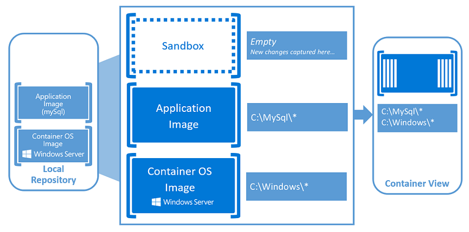
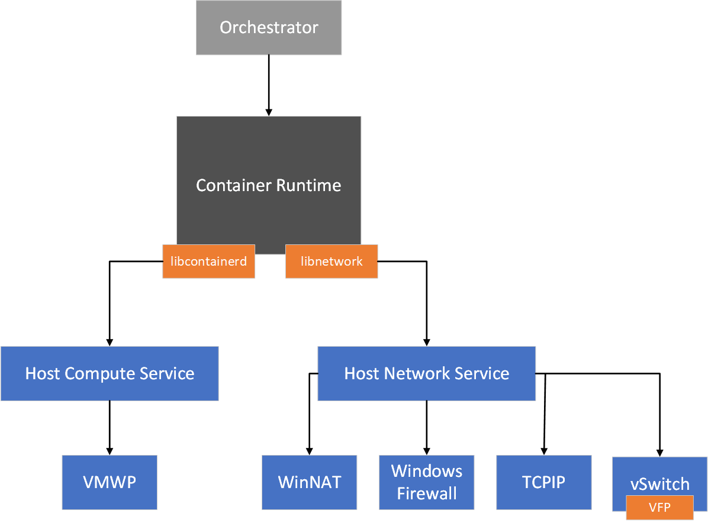
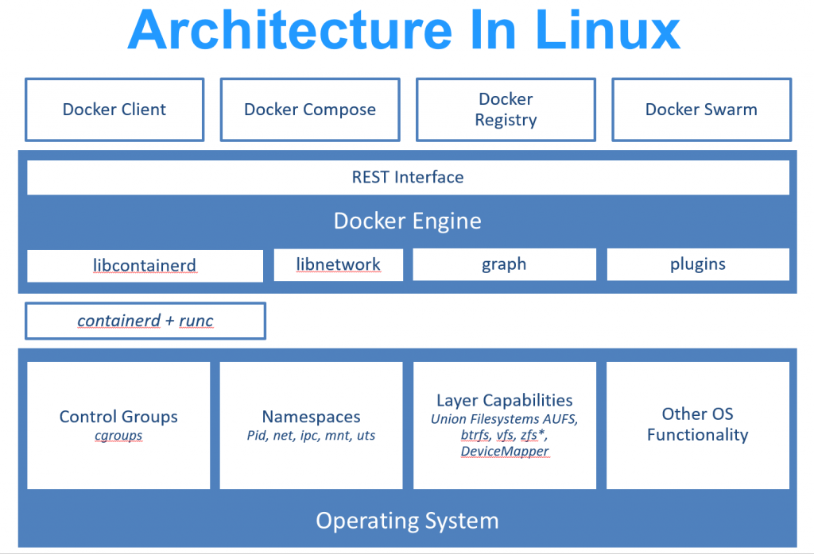
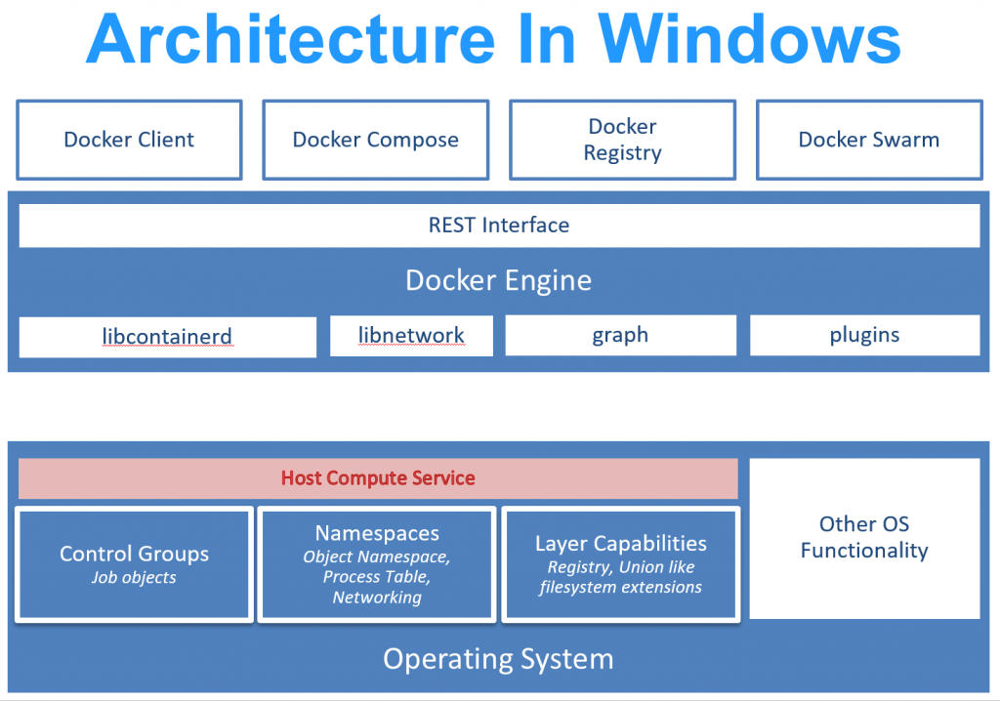

## Windows 컨테이너 소개

Windows 컨테이너 기술은 한창 컨테이너 기술이 업계에서 주목을 받았던 시기일 때 부터 Microsoft가 직접 개발을 진행했습니다. 그리고 Windows Server 2016이 출시되면서 처음 선보였습니다. 그 후 2019년 봄에는 Kubernetes 1.14에서 Kubernetes Worker Node를 [Windows Server 위에서 실행할 수 있도록](https://kubernetes.io/blog/2019/03/25/kubernetes-1-14-release-announcement/) 정식으로 지원하게 되었습니다.

왜 Windows 컨테이너를 사용할까요? 장황하게 설명할 것도 없이 리눅스 컨테이너를 사용하는 것과 같은 이유일 것입니다. 그리고 왜 컨테이너 기술이 필요한지 반문을 하는 사람들 또한 거의 없을 것입니다.

Windows 컨테이너 개요 - [출처](https://docs.microsoft.com/en-us/virtualization/windowscontainers/about/)

Windows 컨테이너는 리눅스 컨테이너와 유사한, 그리고 호환되는 아키텍처를 사용합니다. 그리고 기존의 리눅스 컨테이너를 빌드하는 방법과 동일하게 Dockerfile을 이용하여 원하는 내용을 추가할 수 있습니다.

다만 Windows 컨테이너는 OS 이미지는 [mcr.microsoft.com 이미지 레지스트리](https://hub.docker.com/_/microsoft-windows-base-os-images)로부터 내려받는다는 것, 그리고 컨테이너를 빌드하고 실행하기 위해서는 Windows 운영 체제가 필요하다는 것이 다른 점입니다.

이렇게 만들어진 이미지로 새로운 Windows 컨테이너를 곧바로 실행하거나, 또는 Docker Hub나 직접 관리하는 이미지 레지스트리에 게시하여 다른 사람들에게 공유할 수 있습니다.

## Windows 컨테이너 아키텍처

앞에서 살펴본 것처럼 Windows 컨테이너의 사용 방법은 리눅스 컨테이너와 큰 차이가 없습니다. 그러나 세부적인 내용을 살펴보면 기술적으로는 큰 차이를 가지고 있습니다.

Windows 컨테이너에서 핵심이 되는 시스템은 크게 두 가지입니다. 바로 Host Compute Service (HCS)와 Host Network Service (HNS) 입니다.

HCS와 HNS - [출처](https://docs.microsoft.com/en-us/virtualization/windowscontainers/container-networking/architecture)

HCS와 HNS에 대한 이야기를 계속하기 위하여 몇 가지 소 주제로 나누어서 이야기를 해보겠습니다.

### 컨테이너 런타임

리눅스에서는 컨테이너가 아래 그림과 같은 아키텍처 위에서 실행됩니다.

리눅스 컨테이너 아키텍처 - [출처](https://docs.microsoft.com/en-us/virtualization/windowscontainers/deploy-containers/containerd)

그리고 Windows에서는 컨테이너가 아래 그림과 같은 아키텍처 위에서 실행됩니다.

Windows 컨테이너 아키텍처 - [출처](https://docs.microsoft.com/en-us/virtualization/windowscontainers/deploy-containers/containerd)

리눅스와는 다르게 HCS라는 핵심 구성 요소가 리눅스의 Control Group (cgroup), 네임스페이스, 파일 시스템 계층화 기능을 모두 담당합니다.

containerd 기반의 런타임을 사용하는 리눅스와는 달리, 현재 docker.com 웹 사이트에서 회원 가입 후 내려받을 수 있는 Docker Community Editon (CE) 및 Enterprise Edition (EE)의 Windows 버전에서의 Windows Container는 HCS v1 API를 직접 지원하도록 수정된 Docker Engine을 사용합니다.

위의 그림에는 표현이 되어있지 않지만, Windows의 경우에도 containerd의 Windows 버전이 현재 개발 중이며, containerd의 기능을 지원할 수 있도록 기능이 강화된 HCS v2 API가 새로 추가되었습니다. 추후 Kubernetes Windows Worker Node와 Windows용 Docker는 containerd를 경유하여 HCS v2와 상호작용하는 방식으로 개선될 것입니다.

### 컨테이너 이미지

HCS가 관리하는 영역 중에 큰 의미를 가지는 또 다른 부분인 컨테이너 이미지에 대한 이야기는 내용이 조금 길어서 따로 이야기해보겠습니다.

기술적으로 Windows OS 컨테이너 이미지는 Hyper-V가 사용하는 VHDX (Hyper-V가 사용하는 가상 하드 디스크 이미지 포맷) 형식을 이용하여 차등분을 저장하는 형태로 관리됩니다.

하지만 Open Container Initiative (OCI) 사양을 따르도록 되어있기 때문에 Windows OS만을 위한 별도의 이미지 레지스트리를 구축할 필요가 없습니다. 단, 뒤에서 설명할 라이선스 상의 이슈로 최초의 루트 이미지는 `mcr.microsoft.com` 서버에서 받도록 되어있습니다.

다음에 올릴 블로그 글에서 다시 설명하겠지만, 컨테이너 OS 이미지는 Windows Server 1809 (2019) 기준으로 용도에 맞게 총 3가지의 서버용 이미지가 제공됩니다.

컨테이너화 하려는 대상 애플리케이션의 특성에 맞는 이미지를 찾아 Base 이미지로 사용하면 됩니다.

### 컨테이너 네트워킹

HCS에 의하여 컨테이너 런타임이 관리되는 것과 별도로 HNS라는 구성 요소가 네트워킹을 담당합니다.

HNS는 컨테이너가 외부 네트워크와 정상적으로 통신할 수 있도록 가상 네트워크를 만들고, 그 네트워크에 컨테이너를 부착하는 일도 해줍니다.

HNS에 대해 설명하기에 앞서 Hyper-V Virtual Switch에 대한 이야기를 먼저 해보겠습니다.

Host Network Service 아키텍처 - [출처](https://docs.microsoft.com/ko-kr/virtualization/windowscontainers/container-networking/network-isolation-security)

컨테이너를 사용하는 환경이 아니더라도, Windows는 Hyper-V를 사용하도록 구성하면 OS 차원에서 Hyper-V Virtual Switch라는 것을 만듭니다. 그 후에는 실제 NIC와 직접 통신하지 않고 이 Virtual Switch에 부착되는 vNIC을 통해 호스트 컴퓨터가 NIC와 통신하도록 시스템 구성이 바뀌게 됩니다.

이 Virtual Switch에는 Virtual Filtering Platform (VFP)이라는 구성 요소가 내장되어있습니다. 이 구성 요소는 Software Defined Networking을 구현하면서, 가상 네트워크 환경과 외부 네트워크 사이의 Ingress/Egress를 처리하게 됩니다.

정리하면 Windows 서버 상에서는 Virtual Switch에 연결되는 방식에는 조금씩 차이가 있지만, 컨테이너이건 가상 컴퓨터이건 Hyper-V Virtual Switch를 통해 연결되는 방식입니다.

이렇게 만들어지는 복잡한 네트워크 구성을 프로그래밍 방식으로 쉽게 제어할 수 있도록 해주는 것이 HNS입니다.

## Windows 컨테이너의 라이선싱

Windows Server에서 가장 까다롭고 골치아픈 부분은 역시 라이선스에 대한 부분입니다.

리눅스와 달리 Windows는 오직 Microsoft만이 이미지를 제작하고 배포할 수 있는 독점권을 가지고 있습니다. 생각해보면 이것은 당연한 이야기입니다. 그리고 이것은 컨테이너 OS 이미지에 대해서도 마찬가지입니다.

이 때문에 Windows 컨테이너 OS 이미지를 실제 서비스용으로 사용하기 위해서는 Windows Server 호스트에 대한 라이선스를 보유하고 있어야 합니다.

하지만 클라우드 컴퓨팅 환경 (AWS, Azure, GCP 등)에서 Windows Server 인스턴스를 사용하고 계시다면 대체로 라이선스에 대한 고민은 하지 않아도 됩니다.

그러나 직접 Windows 서버를 데이터센터에 구축해서 사용하고 있거나, 그럴 계획이라면 반드시 [이 페이지](https://www.microsoft.com/en-us/licensing/product-licensing/windows-server)의 내용을 검토하시는 것이 좋습니다.

기본적으로 보유하고 있는 Windows Server OS의 라이선스의 상품 종류에 상관 없이 프로세스 격리 방식의 컨테이너는 실행 개수에 제한이 없습니다.

다만 Standard Edition로 실행 중인 Windows Server에서는 라이선스 상 Hyper-V 컨테이너 방식의 컨테이너는 최대 2개만 실행이 허용됩니다. 라이선스 상 갯수 제약 없이 Hyper-V 컨테이너를 실행하려면 Datacenter Edition에 대한 라이선스를 구매하여 적용해야 합니다.

아울러 Windows 10 PC에서 컨테이너를 만들고 테스트하는 것은 어떤 형태로 Windows 10 라이선스를 사용하고 있던 관계없이 [개발과 테스트 목적으로만 기능과 라이선스가 제한](https://docs.microsoft.com/en-us/virtualization/windowscontainers/about/faq#can-i-run-windows-containers-in-process-isolated-mode-on-windows-10-enterprise-or-professional)됩니다.