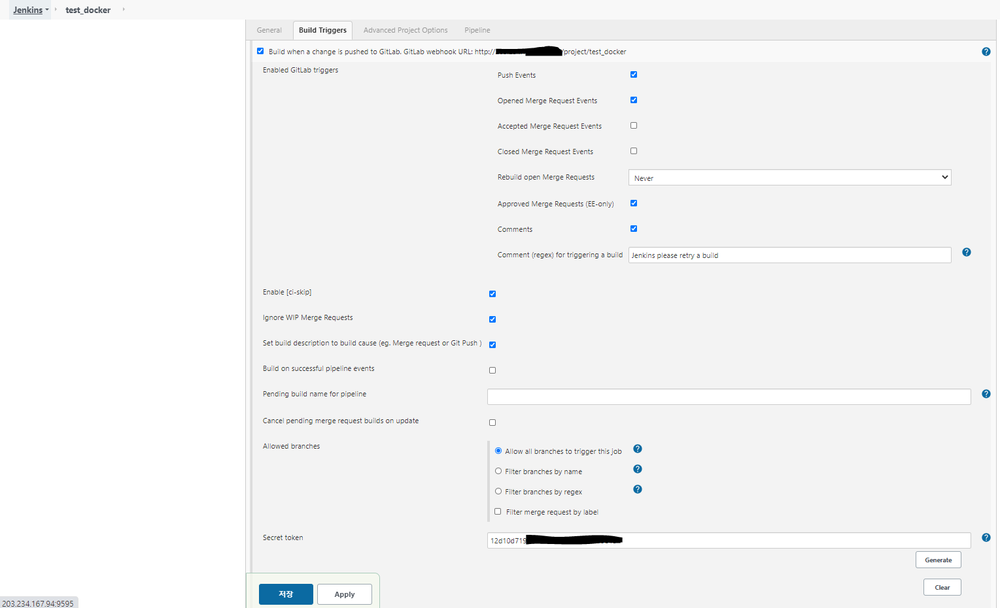
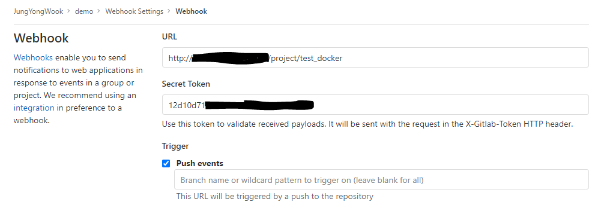
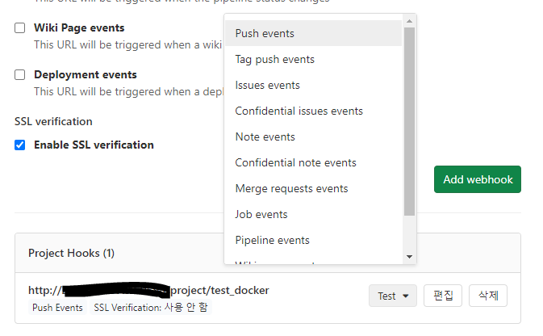
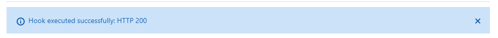

# Jenkins Docker image Build 방법


### Docker-compose파일과 Dockerfile을 아래와 같이 만듭니다

```shell
$ tree .
.
├── build
│   └── Dockerfile
└── docker-compose.yml

1 directory, 2 files
```

docker-compose.yml

```yaml
version: "3.8"

services:

  jenkins:
    container_name: jenkins-container
    build: build/
    image: ywjung99/jenkins:v3 
    ports:
    - 8080:8080
    volumes:
    - "jenkins.data:/var/jenkins_home"
    - "/var/run/docker.sock:/var/run/docker.sock"
    
volumes:
  jenkins.data: 
```

Dockerfile

```dockerfile
FROM jenkins/jenkins:lts-alpine

USER root

RUN apk add docker
ENV DOCKER_COMPOSE_VERSION 1.27.4
RUN curl -fsSL https://github.com/docker/compose/releases/download/$DOCKER_COMPOSE_VERSION/docker-compose-`uname -s`-`uname -m` > /usr/local/bin/docker-compose && chmod +x /usr/local/bin/docker-compose
```


docker-compose를 이용한 Build

```shell
$ docker-compose build
Building jenkins
Step 1/5 : FROM jenkins/jenkins:lts-alpine
 ---> b5d838746d82
Step 2/5 : USER root
 ---> Running in d646f8a2b7f1
Removing intermediate container d646f8a2b7f1
 ---> 544bbc899fbc
Step 3/5 : RUN apk add docker
 ---> Running in 5a3448e24b6e
fetch http://dl-cdn.alpinelinux.org/alpine/v3.12/main/x86_64/APKINDEX.tar.gz
fetch http://dl-cdn.alpinelinux.org/alpine/v3.12/community/x86_64/APKINDEX.tar.gz
(1/11) Installing libseccomp (2.4.3-r0)
(2/11) Installing runc (1.0.0_rc10-r1)
(3/11) Installing containerd (1.3.4-r1)
(4/11) Installing libmnl (1.0.4-r0)
(5/11) Installing libnftnl-libs (1.1.6-r0)
(6/11) Installing iptables (1.8.4-r2)
(7/11) Installing tini-static (0.19.0-r0)
(8/11) Installing device-mapper-libs (2.02.186-r1)
(9/11) Installing docker-engine (19.03.12-r0)
(10/11) Installing docker-cli (19.03.12-r0)
(11/11) Installing docker (19.03.12-r0)
Executing docker-19.03.12-r0.pre-install
Executing busybox-1.31.1-r16.trigger
Executing glibc-bin-2.31-r0.trigger
/usr/glibc-compat/sbin/ldconfig: /usr/glibc-compat/lib/ld-linux-x86-64.so.2 is not a symbolic link

OK: 381 MiB in 59 packages
Removing intermediate container 5a3448e24b6e
 ---> f16f9972ee9e
Step 4/5 : ENV DOCKER_COMPOSE_VERSION 1.27.4
 ---> Running in 75afe467ed18
Removing intermediate container 75afe467ed18
 ---> dc9c04de8784
Step 5/5 : RUN curl -fsSL https://github.com/docker/compose/releases/download/$DOCKER_COMPOSE_VERSION/docker-compose-`uname -s`-`uname -m` > /usr/local/bin/docker-compose && chmod +x /usr/local/bin/docker-compose
 ---> Running in 5cccd66c7fab
Removing intermediate container 5cccd66c7fab
 ---> 47d6b3b3f0cc

Successfully built 47d6b3b3f0cc
Successfully tagged ywjung99/jenkins:v3

$ docker images | grep ywjung99/jenkins
ywjung99/jenkins                           v3                  47d6b3b3f0cc        2 minutes ago       690MB
```


끝.... 이거 별거 아닌데 이틀동안 뻘짓을 얼마나 했는지 ㅜㅜ;


## GitLab Push 할떄 Jenkins 자동 Build 실행 방법


최근에 git 기반의 서비스들(github, bitbucket, gitlab)은 Webhooks 기능을 기본적으로 제공합니다. Webhooks는 해당 git repository에 push, commtit, tag와 같은 이벤트가 발생하면 Jenkins와 같은 CI 서버에 이벤트를 전달하는 기능입니다. Webhooks 이벤트를 전달받은 CI서버는 해당 프로젝트의 빌드 프로세스를 시작하는 방식으로 Git 레파지토리와 CI 서버를 연동하는 방법입니다. Git 레파지토리가 호출하는 Webhooks는 HTTP URL(Restful 서비스)입니다. 이러한 방법으로 자동 빌드를 실행해 보고자 합니다.


### Jenkins 설정 

> 1. 구성 > Build Tgiggers > Build when a change is pushed to GitLab. GitLab webhook URL: http://xxx/project/test_docker을 선택한다.
> 2. 고급 > Secret token > Generate를 클릭하여 token을 생성한후 저장한다.



### GitLab  설정

> 1. GitLab의 프로젝트에 들어가서 설정>webhooks를 클릭한다.
> 2. URL은 jenkins build trigger에 나온 URL을 입력한다.
> 3. Secret Token은 jenkins build trigger에 나온 Secret Token을 입력한다.



> 생성후 Project Hooks test 선택박스에서 Push events를 선택하면 Push test를 할 수있다.



> 아래와 같이 200이 응답되면 Jenkins에서 자동적으로 Builf를 시작하게 될것입니다.

